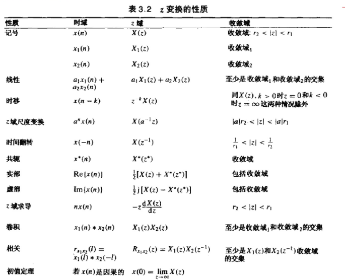
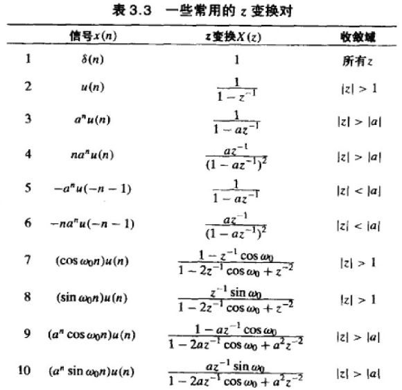
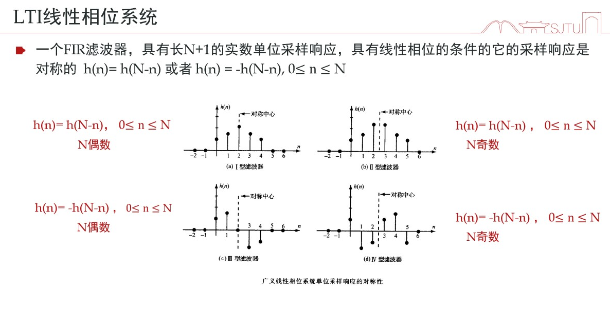
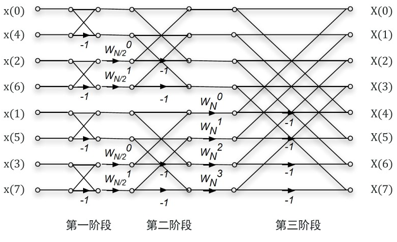

选择*6 填空*8 计算*6
## 1. 基础
* 信号能量 $E_x=\sum_{0}^{N-1}|x(n)|^2$
* 信号功率 $P_x=\frac 1 N \sum_{0}^{N-1}|x(n)|^2$

## 2. 采样定理
### 2.1. 采样
$\hat{x}_a(t)=x_a(t)\cdot P_{\delta}(j\Omega)$
$\hat{X}_a(j\Omega)=\frac 1 T\sum_{k=-\infty}^{+\infty}X_a(j\Omega-jk\Omega_s),\Omega_s=\frac{2\pi}T$
$X(j\Omega)\in [-\Omega_c,+\Omega_c]$
$\Omega_s>2\Omega_c$
* 奈奎斯特频率`Nyquist frequency` $\Omega_s=\frac {2\pi}{T}$
* 奈奎斯特间隔`Nyquist interval` $T=\frac {1}{f_s}$
* 信号的折叠频率`folding frequency` $\frac {\Omega_s}{2}$
### 2.2. 重建
$X_r(j\Omega)=H_r(j\Omega)|\hat{X}_a(j\Omega)|$
$H_r(j\Omega)=T,|T|<\Omega_s / 2 \to h_r(t)=\frac{T}{\pi t}sin(\frac{\pi}{T}t)=sinc(\frac t T)$
$x_r(t)=\sum_n x_a(nT)\frac{sin(\pi(t-nT)/T)}{\pi (t-nT)/T}$

## 3. z变换
$X(z)=\sum_{n=-\infty}^{+\infty}x(n)z^{-n}$
$X(z)=\displaystyle\frac{b_0\prod_{k=1}^{M}(1-c_kz^-1)}{a_0 \prod_{k=1}^N (1-d_kz^{-1})}$

* 变换性质

单边z变换$X^+(z)=\sum_{n=0}^{+\infty}x(n)z^{-n}$
仅对因果信号独特

* 单边z变换的移位特性
$Z^+[x(n-k)]=z^{-k}[X^+(z)+\sum_{n=1}^kx(-n)z^n],k>0$
$Z^+[x(n+k)]=z^{-k}[X^+(z)-\sum_{n=0}^{k-1}x(n)z^{-n}],k>0$
## 4. 系统
* 零极点图

|---|时域|z域|
|---|---|---|
|因果性|$h(n)=0,n<0$|ROC:$R_{h-}\le z \le \infty$|
|稳定性|$\sum_{n=-\infty}^{+\infty}\|h(n)\|<\infty$|ROC包含单位圆|

$y(n)=y_{zs}(n)+y_{zi}(n)$
$Y_{zs}(z)=H(z)X(z)$
$Y^+_{zi}(z)=N_0(z)/A(z)$

* 非零初始条件的系统响应
差分方程两边(单边)z变换-代入初始条件-在z域求解方程-z逆变换求时域解

特征函数$e^{j\omega_0 n}$
特征值 $H(\omega)|_{\omega=\omega_0}$
## 5. 频率分析
### 5.1. 傅里叶变换
| ---|连续信号||离散信号|||
| ---|---|---|---|---|---|
|周期性|周期|非周期|周期|非周期||
|频域变换|傅里叶级数|傅里叶变换|傅里叶级数DFS|傅里叶变换DTFT|离散傅里叶变换DFS|
|表达(反变换)|$x(t)=\sum_{k=-\infty}^{\infty}c_ke^{j\frac{2k\pi}{T}t}$|$x(t)=\frac{1}{2\pi}\int_{-\infty}^{+\infty}X(F)e^{j 2\pi Ft}dF$|$x(n)=\sum_{k=0}^{N-1}C_ke^{j2\pi kn/N}$|$x(n)=\frac{1}{2\pi}\int_{-\pi}^{\pi}X(\omega)e^{j\omega n}$|$x(n)=\frac{1}{N}\sum_{0}^{N-1}X(k)e^{j \frac{2\pi k}{N} n}$|
|参数(变换)|$c_k=\frac 1 T\int_T x(t)e^{-j\frac{2k\pi}{T}t}dt$|$X(F)=\int_{-\infty}^{+\infty} x(t)e^{-j2\pi F t}dt$|$C_k=\frac 1 N \sum_{k=0}^{N-1}x(n)e^{-j2\pi kn/N}$|$X(\omega)=\sum_{-\infty}^{\infty}x(n)e^{-j\omega n}$($2\pi$周期性)|$X(k)=\sum_{n=0}^{N-1}x(n)e^{-j\frac{2\pi k}{N}n}$(k=0,1,,,N-1)|
|Parseval's $P_x=\frac 1 T \int\|x(t)\|^2dt=\frac 1 N \sum_{k=0}^{N-1}\|x(n)\|^2 $ | $\sum \|C_k\|^2$|$E_x=\int \|X(F)\|^2dF$|$\sum \|C_k\|^2$|$E_x=\frac{1}{2\pi}\int_{-\pi}^{\pi} \|X(\omega)\|^2d\omega$|$E_x=\frac 1 N\sum_{k=0}^{N-1}X(k)\cdot X^{\ast}(k)$|
|能量谱密度||||$S_{XX}=\|X(\omega)\|^2$||
||
|变换||||z变换|
|表达||||$X(z)=\sum_{-\infty}^{\infty}x(n)z^{-n}$|
|Hint||||DTFT是单位圆上的z变换|单位圆等间隔取样$\frac{2\pi}{N}$|

* **$\omega$和F的关系？？？**
* DFT是DFS的主值区间，DFS是DFT的周期延拓。
* 补零：增加DFT频谱抽样频率。
* DFT 隐含周期性$x(n+mN)=x(n)$
* 线性卷积 $L\ge N+M-1$，圆周卷积 $L=max(N, M)$
* 圆周卷积：优点-DFT计算方便；缺点-不能实时处理，延迟
  * 利用圆周卷积计算线性卷积-补零到L+M-1
  * 将离散信号拆分成长度有限的信号，分别计算卷积并拼接。
  * 重叠相加法：分段补零DFT卷积后重叠部分相加
* 信号加窗(加窗对频率分辨率的影响)
  DTFT:矩形窗长度L, 信号长度$T_0=LT$, $\Delta \omega = 2\pi/L$
  $L\ge 2 \pi /|\omega_0 - \omega_1|$
  DFT频谱分辨率$\Delta \omega=\frac{2\pi}N$
### 5.2. 幅度谱与相位谱
* 注意相位谱要解缠绕-> $-\pi \to \pi$
### 5.3. Gibbs现象
$X(\omega)$的不连续点处，$X_N(\omega)$逼近函数$X(\omega)$的振荡行为。
### 5.4. 时域与频域的对偶性
* 周期-离散
* 抽样-搬移
### 5.5. 系统的频率响应函数
> 缩放 移位
* 零极点判断
$H(\omega)=b_0e^{j\omega(N-M)}\displaystyle\frac{\prod_{k=1}^M(e^{j\omega}-z_k)}{\prod_{k=1}^N(e^{j\omega}-p_k)}$
-> z平面单位圆$-\pi \to \pi$
* 低通：极点靠$\omega=0$，零点靠$\omega=\pi$

#### 5.5.1. 群时延
* 线性相位 $\theta(\omega)=-\omega n_0$
* 群时延 $-\frac{d\theta(\omega)}{d\omega}=$常数

#### 5.5.2. 逆系统
输入信号与输出信号一一对应
H(z)分子分母翻转（注意ROC）
#### 5.5.3. 全通滤波器
纯延迟系统-> 相位均衡器
#### 5.5.4. 低通与高通互换
$H_{hp}(\omega)=H_{lp}(\omega-\pi)$
$h_{lp}(n)=(-1)^n h_{hp}(n)$
### 5.6. 变换的性质
> 略：线性

|---|时域|频域|---|
|---|---|---|---|
|---|$x(n)$|DTFT|DFT|
|时移|$x(n-l)$|$X(\omega)e^{-j\omega l}$|$X(k)e^{-j\frac{2\pi k}{N}l}$|
|频移|$x(n)e^{j\omega_0 n}$|$X(\omega-\omega_0)$|$x(n)e^{j\frac{2\pi l}N n}\to X(k-l)_N$|
|翻转|$x(-n)$|$X(-\omega)$|$x(N-n)\to X(N-k)$|
|时域微分|$\frac{d}{dn}x(n)$|$j\omega X(\omega)$|
|频域微分|$nx(n)$|$j\frac d {d\omega}X(\omega)$|
|卷积|$x_1(n)\ast x_2(n)$|$X_1(\omega)X_2(\omega)$|圆周卷积$\circ$|
|窗口/调制|$x_1(n)x_2(n)$|$\frac 1 {2\pi}\int_{-\pi}^{\pi}X_2(\theta)X_1(\omega-\theta)d\theta$|$\frac 1 N X_1(k)\circ X_2(k)$|
|共轭对称性|$x(n)$为实信号|$X^{\ast}(\omega)=X(-\omega)$|
||$x^{\ast}(n)$|$X^{\ast}(-\omega)$|$X^{\ast}(N-k)$

### 5.7. 常见变换对
ps:注意0的情况
|信号|DTFT|
|---|---|
|$\delta(n)$|1|
|$a^nu(n),\|a\|<1$|$\frac 1{1-ae^{-j\omega}}$|
|$x(n)=1,\|n\|\le L$|$\frac{sin([(L+\frac 1 2)\omega])}{sin(\frac 1 2 \omega)}$|
|$x(n)=\frac{sin \omega_c n}{\pi n}$|$X(\omega)=1,\|\omega\|\le \omega_c$|
## 6. 快速傅里叶FFT
> 蝶形图
> 蝶形:减少运算量/原位:减少存储/乱序输入/规律取数

序号排列:翻转二进制

$W_N^{nk}=e^{j2\pi k n /N}$
|---|DFT|FFT|
|---|---|---|
|复数乘法|$N^2$|$\frac N2 log_2 N$|
|复数加法|$N(N-1)$|$2\times\frac N2 log_2 N$|
|计算量等级|$O(N^2)$|$O(N^2/2)$|
### 6.1. 加法次数与乘法次数的计算

## 滤波器设计
* FIR
无极点
$y(n)=\sum_{k=0}^M b_k x(n-k)$
* IIR
存在极点
$y(n)=\sum_{k=0}^M b_k x(n-k)-\sum_{k=1}^N a_ky(n-k)$
* 性能参数
  * 通带截止频率$\omega_p$
  * 阻带截止频率$\omega_s$
  * 最大通带/阻带波纹
### FIR
> 优点:稳定/线性相位/方法简单
> 缺点:不同意控制边缘频率/幅频特性不理想,h(n)较长

#### 理想线性相位FIR滤波器-窗函数法
$H_d(\omega)=1,|\omega|\le \omega_c$
$h_d(n)=\omega_c/\pi ,n=0; sin(\omega_c n)/(n\pi),n\ne 0$
矩形窗函数截断 长度`2M+1` $n\in [-M,M]$
右移-因果 $h'(n)=h(n-M)$
.png)
.png)
* 数字角频率 $\omega_c=2\pi f_c T_s=(rad)$
* 代入$h(n)=\omega_c/\pi ,n=0$
$sin(\omega_c n)/(n\pi),n\ne 0,n\in [-M,M]$
* 阶数=2M+1
* 求得 $h(-M)\cdots h(M)$
* 右移-因果$H(z)=[h(M)z^M+\cdots+h(M)z^{-M}]z^{-M}$

#### 一般性FIR窗函数法
> 窗函数的主瓣宽度$\Delta$影响过度带宽, 旁瓣A影响通带阻带波纹
* N升高, $\Delta$减小
* 若改变同一窗函数 A减小 $\Delta$升高
* 通带波纹↓ 阻带衰减 ↑

* 选择窗函数(通带波纹大于要求,阻带衰减小于要求)
* 过度带宽$\Delta \omega=\omega_{st}-\omega_p=2\pi f_{st}T_s-2\pi f_p T_s$
* $N$(尽量小的奇数)和$\omega_c=2\pi (f_{st}-f_p)/2/f_s$
* 带通带阻:叠加
### IIR

> 优点：边缘频率准确，可利用模拟滤波器，结构存在反馈，阶次更低。
> 缺点：相位非线性，稳定性。

计算方法

* 1.把数字滤波器指标 $\omega_p$, $\omega_{st}$，$A_p$，$A_{st}$ 
转换成模拟滤波器指标 $\Omega_p$，$\Omega_{s}$，$A_p$，$A_{st}$

  $\Omega=\omega/T$

  $A_p=20log(1-\delta_1)$//通带波纹

  $A_{st}=20log(\delta_2)$//阻带波纹

* 2.转换成模拟低通滤波器指标

* 3.查表得模拟低通滤波器原型 $H_p(s)$

* 4.得到模拟滤波器 $H_a(s)$

* 5.得到数字滤波器 $H(z)$

#### 冲激响应不变法(时域)

> 时域-对模拟滤波器的单位冲激响应进行抽样(时域特性逼近好)，多值映射

* 已知模拟滤波器系统函数 $H_a(s)$ （部分分式形式）

* 拉普拉斯反变换得单位冲激响应 $h_a(t)=L^{-1}[H_a(s)]$

* 保证冲激响应不变 $h(n)=h_a(t)|_{t=nT}$

* z变换得数字滤波器 $H(z)=\sum_{n=-\infty}^{\infty}h(n)z^{-n}$

形式

$H_a(s)=\displaystyle\sum_{k=1}^{N}\frac{A_k}{s-s_k} \to H(z)=\sum_{k=1}^{N}\frac{A_k}{1-e^{s_kT}z^{-1}}$

tip: 注意频谱混叠现象 $\Omega< \Omega_s/2=\frac\pi T$，不适合高通/带阻数字滤波器

#### 双线性变换法

> 变换域-单一映射

* $ \Omega=\displaystyle\frac 2 T tan(\frac{\omega}{2})$(rad/s)
* $s$带入模拟原型
* 数字滤波器$H(z)=H(s)$$s=\displaystyle\frac{2}{T}\frac{1-z^{-1}}{1+z^{-1}}$
* 代入$H(\omega)(z^-1=e^{j\omega})$, 可验证$20lgH(\omega_c)$

* *Butterworth*滤波器原型$H_a(s)=\frac 1 {s+1} ,(n=1)$
  * $\epsilon^2 =10^{-0.1A_p}-1$
  * 阶数$n \ge\displaystyle\frac{log_{10}(\frac{10^{-0.1A_s}-1}{\epsilon^2})}{2log_{10}(V_s)}$, $V_s=\frac{\Omega_{st}}{\Omega_p}$
  * 查表/代入
* *Chebyshev*滤波器
  * 阶数$n \ge\displaystyle\frac{cosh^{-1}(\frac{10^{-0.1A_s}-1}{\epsilon^2})^2}{cosh^{-1}(V_s)}$, $V_s=\frac{\Omega_{st}}{\Omega_p}$
* 映射关系表

|类型|映射|截止频率|
|---|---|---|
|低通|$\displaystyle\frac s{\Omega_c}$|$\Omega_c$|
|高通|$\displaystyle\frac {\Omega_c}s$|$\Omega_c$|
|带通|$\displaystyle\frac{s^2+\Omega_l\Omega_h}{s(\Omega_h-\Omega_l)}\Omega_c$|$\Omega_l,\Omega_h$|
|带阻|$\displaystyle\frac{s(\Omega_h-\Omega_l)}{s^2+\Omega_l\Omega_h}\Omega_c$|$\Omega_l,\Omega_h$|

### 7.1. 线性相位
$h(n)=H(N-n)/h(n)=-H(N-n)$

$x(t)=A, |t|\le \tau /2$ $X(F)=A\tau \frac{sin \pi F \tau}{\pi F \tau}$