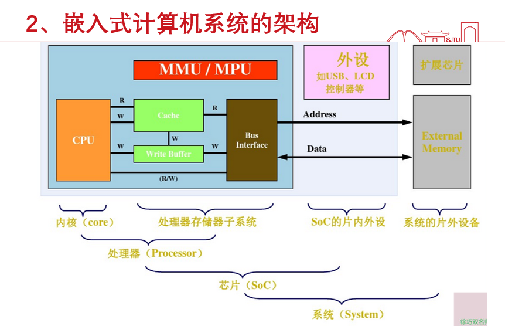
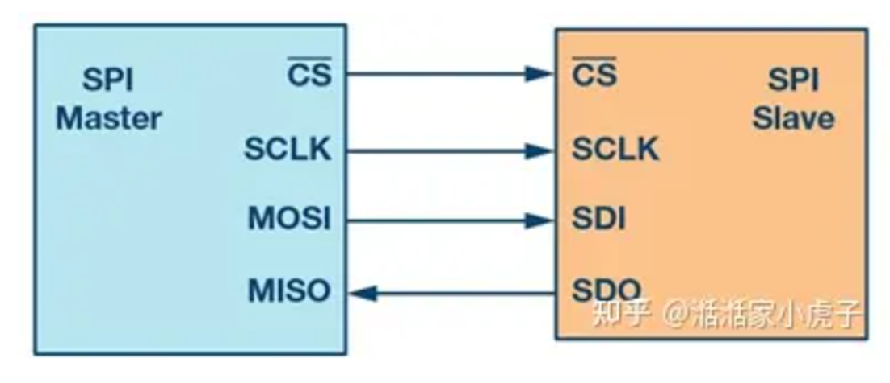

# 嵌入式计算机系统
## 概述

1）HWI 硬件中断

2）I/O 输入输出接口，按键，LED灯，LCD显示等

3）Timer/Counter定时/计数器

4）UART,SPI,I2C等通信接口

5）ADC，DAC，DMA等其他外设

* 医疗仪器的发展趋势
  * 小型化
  * 高集成度
  * 智能化
  * 低功耗
  * 从医院走向家庭（个人）
  * 从有线过渡到无线

* 嵌入式计算机系统
  * 定义: 嵌入式系统是以应用为中心、计算机技术为基础，软、硬件可裁剪，适应应用系统对功能、可靠性、成本、体积、功耗严格要求的专用计算机系统。(通用计算机以外的数字计算机)

  * 特点
    * 功耗低
    * 体积小/便携
    * 专用性强/面向特定应用
    * 可靠性好
    * 不具备自主开发能力
    * 低成本
  * 架构
    * 硬件层(嵌入式处理器(CPU=ALU+)/存储器/通用设备接口/IO接口)
    * 中间层(硬件初始化/相关设备驱动程序)
    * 系统软件层(嵌入式操作系统/文件系统/图形用户接口GUI/网络系统/通用组件模块)
    * 用户应用软件层
    

  * 核心部件
    * CPU
    * 内部总线
    
      程序存储器与数据存储器分开的地址编码结构称为哈佛结构(MCS-51 系列微处理器)
      
      冯诺依曼结构:合并(MSP430)

    * 外设 片内+片外
  
  * 操作系统(!=开发环境!!!)

    * 实时操作系统
  
    * 分时操作系统: 给多个终端/分时操作系统比实时操作系统对任务的管理调度效率更高
  
    * 无操作系统: 裸机应用-应用程序直接运行在硬件上。

  * 分类 (嵌入式芯片: 集成)

    * MCU(Microcontroller Unit-嵌入式微控制器) 高性能 去冗余

    * MPU(Microprocessor Unit-嵌入式微处理器) 一种只包含处理器核心的微处理器(单片机)

    * DSP(Digital Signal Processing-嵌入式数字信号处理器)

    * SOC(System On Chip-嵌入式片上系统) 综合性 硬件描述语言
  
  * 发展趋势
    
    * 系统性
    * 网络信息化
    * 精简，低成本低功耗
    * 友好的界面
* 开发环境
  
  软件仿真/硬件仿真
  
  在线调试/离线调试 无法读取处理器memory或register
    

CPU 的位宽: 数据总线的宽度和寄存器的长度
## MCS51
## MSP430
### USCI
> Universal Serial Communication Interface 通用串行接口模块

* 支持模式
    * USCI_A: UART/SPI/`还有另外两种不要求`
    * USCI_B: IIC/SPI
    * <mark>需要记住:USCI_A有4种模式，B有2种模式<mark>

## SPI
> Serial Peripheral Interface 串行外设接口

全双工/同步/串行/环形总线结构/一主机多从机（不可同时多从机通讯）

* 串行时钟线(SCK)：主设备的输出，从设备的输入
* 主机输入/从机输出数据线(MISO)：主设备输入/从设备输出引脚。
* 主机输出/从机输入数据线(MOSI)：主设备输出/从设备输入引脚。
* 从机选择线(NSS)：低电平有效片选。

ps 从机可 低功耗4模式

* features
    * 7位或8位数据长度
    *  lsb-first或MSB-first
    * 3引脚/4引脚SPI操作
    * 主从模式
    * 独立发送和接收移位寄存器
    * 独立发送和接收缓冲寄存器
    * 连续发送和接收操作
    * 可选时钟极性和相位控制
    * 主模式可编程时钟频率
    * 接收和发送独立中断
    * 从操作可LPM4

* 寄存器
    * UCSYNC set: 选择SPI模式
    * UCMODEX : 3-PIN/4-PIN
    * 发送：
        * 主机模式: 写UCxTXBUF
        * 从机模式: UCxSTE(片选)低电平有效时
    * 接收: 发送时自动接收
    * UCBUSY =1 : 收发进行中

### 基于SPI的TFT模块
可串行或并行控制~

