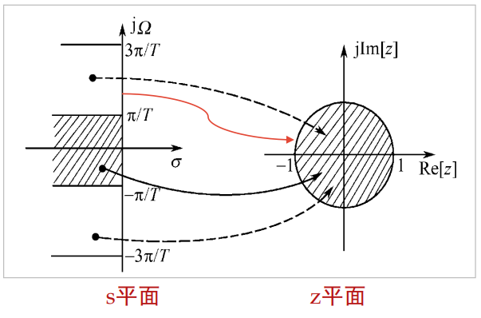
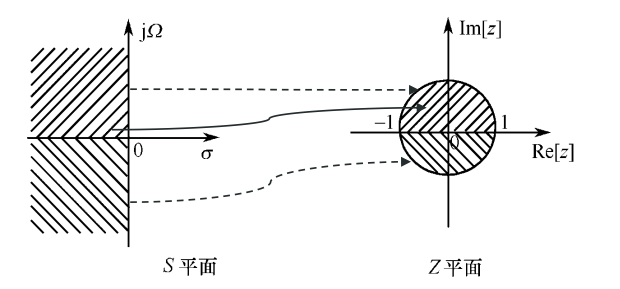

## L13 IIR数字滤波器

> 优点：边缘频率准确，可利用模拟滤波器，结构存在反馈，阶次更低。

> 缺点：相位非线性，稳定性。

### 计算方法

* 1.把数字滤波器指标 $\omega_p$, $\omega_{st}$，$A_p$，$A_{st}$ 转换成模拟滤波器指标 $\Omega_p$，$\Omega_{s}$，$A_p$，$A_{st}$

  $\Omega=\omega/T$

  $A_p=20log(1-\delta_1)$

  $A_{st}=20log(\delta_2)$

* 2.转换成模拟低通滤波器指标

* 3.查表得模拟低通滤波器原型 $H_p(s)$

* 4.得到模拟滤波器 $H_a(s)$

* 5.得到数字滤波器 $H(z)$

### 冲激响应不变法

> 时域-对模拟滤波器的单位冲激响应进行抽样(时域特性逼近好)，多值映射

#### 步骤

* 已知模拟滤波器系统函数 $H_a(s)$ （部分分式形式）

* 拉普拉斯反变换得单位冲激响应 $h_a(t)=L^{-1}[H_a(s)]$

* 保证冲激响应不变 $h(n)=h_a(t)|_{t=nT}$

* z变换得数字滤波器 $H(z)=\sum_{n=-\infty}^{\infty}h(n)z^{-n}$

#### 形式

$H_a(s)=\displaystyle\sum_{k=1}^{N}\frac{A_k}{s-s_k} \to H(z)=\sum_{k=1}^{N}\frac{A_k}{1-e^{s_kT}z^{-1}}$

tip: 注意频谱混叠现象 $\Omega< \Omega_s/2=\frac\pi T$，不适合高通/带阻数字滤波器

### 双线性变换法

> 变换域-单一映射

$s=\displaystyle\frac{2}{T}\frac{1-z^{-1}}{1+z^{-1}}$

$ \Omega=\displaystyle\frac 2 T tan(\frac{\omega}{2})$

* *Butterworth*滤波器原型$H_a(s)=\frac 1 {s+1} ,(n=1)$

* 阶数$n \ge\displaystyle\frac{log_{10}(\frac{10^{-0.1A_s}-1}{\epsilon^2})}{2log_{10}(V_s)}$, $V_s=\frac{\Omega_{st}}{\Omega_p}$

#### 映射关系表

|类型|映射|截止频率|
|---|---|---|
|低通|$\displaystyle\frac s{\Omega_c}$|$\Omega_c$|
|高通|$\displaystyle\frac {\Omega_c}s$|$\Omega_c$|
|带通|$\displaystyle\frac{s^2+\Omega_l\Omega_h}{s(\Omega_h-\Omega_l)}\Omega_c$|$\Omega_l,\Omega_h$|
|带阻|$\displaystyle\frac{s(\Omega_h-\Omega_l)}{s^2+\Omega_l\Omega_h}\Omega_c$|$\Omega_l,\Omega_h$|
