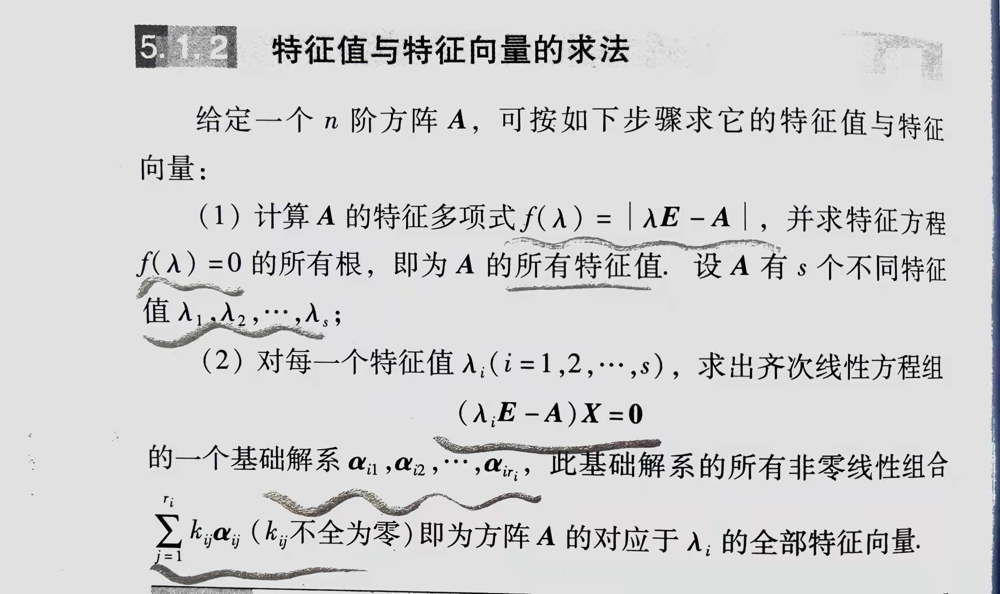
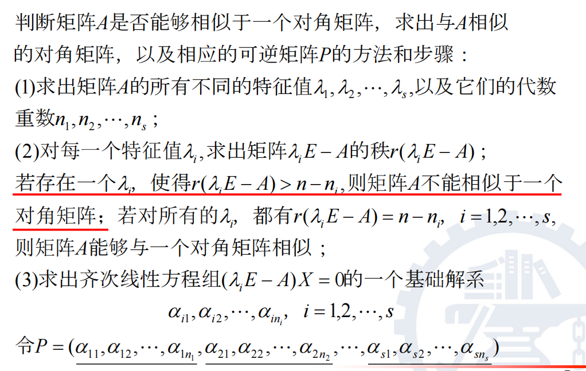
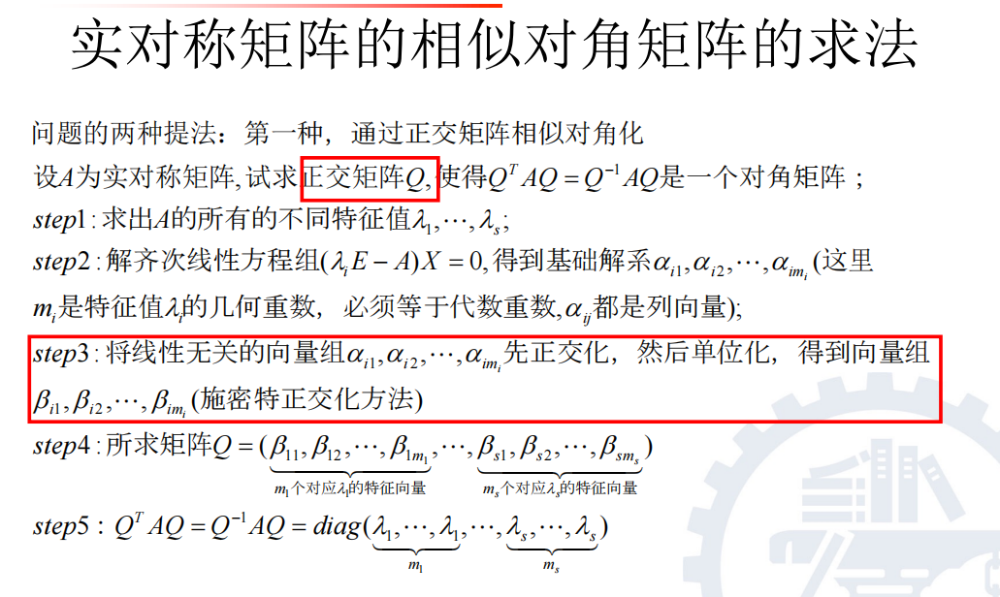

## 线性方程组解的求法
* 增广矩阵初等行变化至阶梯型
* 判断解的情况
* 有解时 变化到简化阶梯型
* 唯一解直接写出
* 无穷多解：写出简化阶梯型对应的方程组 确定自由未知量(一个x) 写出一般解
  
##
★求逆矩阵的初等变换法: 构造分块矩阵$[A E]使R_1R_2...R_s[A,E]=[E A^-1]$

$$
\begin{bmatrix}
a_1 & a_2 & \cdots & a_n \\
a_1 & a_2 & \cdots & a_n \\
\vdots & \vdots & \ddots & \vdots \\
a_1 & a_2 & \cdots & a_n \\
\end{bmatrix}
$$ 
https://blog.csdn.net/mediatec/article/details/88820425