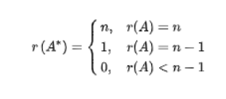
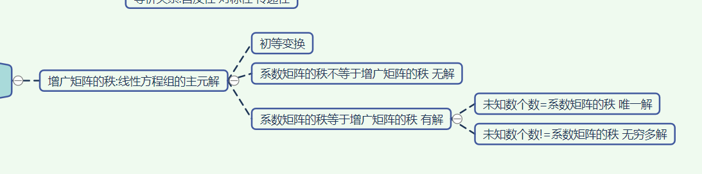
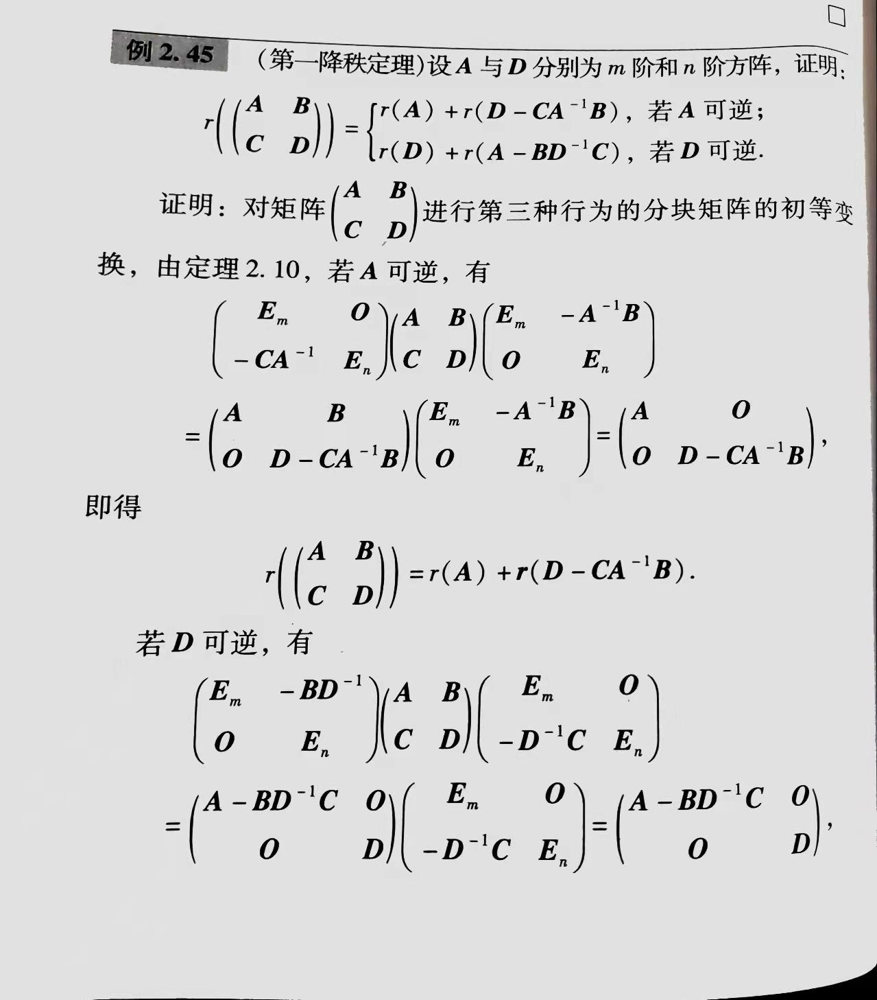

https://blog.csdn.net/I_canjnu/article/details/105778485
 - [x]
  
  
  

 - [x]
  
  

$\lambda^m|\lambda En -MN|=\lambda^n|\lambda Em-NM|$
---
## 运算

### 线性运算 略
### 矩阵的乘法:
* **行$\cdot$列**
* 性质
  结合律，分配律
  不满足交换律，消去律，非O*非O可得O
    *AB=BA AB相乘可换:对角矩阵*

### 幂
* A^0=En
* 求高次幂 数归 结合律 分解（拆成E+A 相乘可换 高次为0）
* 方阵的多项式
    把A带入x

### 转置
    A^T / A'
* 性质 
    $(A_1A_2\cdots A_n)^{T}=A_n^T \cdots A_2^T*A_1^T$
    对称矩阵$A^T=A$;反对称矩阵$A^T=-A$   //判定常用
    *tips:$A=(A+A^T)/2+(A-A^T)/2$*

### 迹
  $tr(A)=\sum_{i=1}^{n} a_{ii}$
* 性质 tr(AB)=tr(BA)

---
## 行列式
    |ai,j|n |A| detA
**$D=\sum_{j_1j_2\cdots j_n}(-1)^{\zeta(i_1i_2\cdots i_n)+\zeta(j_1j_2\cdots j_n)}a_{i_1j_1}a_{i_2j_2}\cdots a_{i_nj_n}$**
*$\zeta$表示逆序数对*
* $M_{i,j}$:元素$a_{i,j}$的余子式：划掉i行j列后的行列式
* $A_{i,j}$:代数余子式：=$(-1)^{i+j}M_{i,j}$
**$|A|=\sum_{k=1}^n a_{1,k}A_{1,k}$**  //任意行列均可
$|A_n^*|=|A|^{n-1}$

#### 性质
* $|A|=|A^T|$
* 行交换：行列式改变符号 $\to$ 行相同：行列式为0 $\to$ 第i行元素与第j行代数余子式依次相乘 =0
* 行列公因子可提到外面
* 单独行列可拆成和的形式 $\to$ 行或列k倍加 行列式不变
* |AB|=|A||B|

#### 范德蒙德(Vandermonde)行列式
$$
\begin{bmatrix}
1 & 1 & \cdots & 1 \\
x_1 & x_2 & \cdots & x_n \\
\vdots & \vdots & \ddots & \vdots \\
x_1^{n-1} & x_2^{n-1} & \cdots & x_n^{n-1} \\
\end{bmatrix}
$$ 
* 从n-1开始每行的$-x_1$倍加到后一行
$$
\begin{bmatrix}
1 & 1 & \cdots & 1 \\
0 & x_2-x_1 & \cdots & x_n-x_1 \\
0 & x_2(x_2-x_1) & \cdots & x_n(x_n-x_1) \\
\vdots & \vdots & \ddots & \vdots \\
0 & x_2^{n-2}(x_2-x_1) & \cdots & x_n^{n-1}(x_n-x_1) \\
\end{bmatrix}
$$ 
**$D_n=(x_2-x_1)\cdots(x_n-x_1)D_{n-1}=\cdots=\prod_{1\le j<i\le n}(x_i-x_j)$**

#### 拉普拉斯定理
D(n,n):在D中任意取k行，由这k行元素所组成的全体k阶子式记作$M_1,M_2\cdots M_t$ $t=\mathbb{C}_n^k $
$D=\sum_{i=1}^tM_iA_i$  *A为对应的代数余子式*

---
## 可逆矩阵
    AB=BA=E B=A^-1
* 伴随矩阵$A^*$：代数余子式转置排列
  
#### 伴随矩阵法：**$A^{-1}=\displaystyle\frac{1}{|A|}A^*$** ---------  A*A=|A|E
可逆：|A|$\ne$0 A的标准型为E A=一系列初等矩阵的乘积

#### 初等变换法 见后

#### 克拉默(Cramer)法则
**Ax=b 当系数D行列式|A|$\ne$0时有唯一解**
**$x_j=\displaystyle\frac{D_j}{D}$** *$D_j$表示D中第j列换成b的行列式* 证明略

* 性质
  $(AB)^{-1}=B^{-1}A^{-1}$
  $(A^T)^{-1}=(A^{-1})^T$
  $|A^{-1}||A|=1$

---

## 分块矩阵
A的列分法=B的行分法
#### 分块（反）对角阵
易于求逆
分块矩阵的初等变换 同 见后

---

## 初等矩阵
**E+一次初等变换**
AB可通过初等变换互相得出：相抵 等价关系:自反性 对称性 传递性
**左/右乘初等矩阵=相应初等行列变换**  *分块证明*
* 性质:可逆:逆变换易求
* 定理:$A_{mn} 存在R_iR_i-1...R_1A为阶梯矩阵;存在R_iR_i-1...R_1AC_1C_2...C_j为标准矩阵$
* 推论:$A_{mn} 存在P_mAQ_n为标准矩阵;PQ可逆;r=r(A)$
  推论:矩阵乘以一个可逆阵，秩不变
#### 初等变换法求逆矩阵：
A可逆 $存在R_iR_i-1...R_1A=E A=R_1^{-1}...R_{i-1}^{-1}$  充要
★求逆矩阵的初等变换法: 构造分块矩阵$[A E]使R_1R_2...R_s[A,E]=[E A^-1]$
或者竖着拼进行初等列变换
可由此求方程组的解 [A|B] 初等行变换 $[E|A^{-1}B]$

---

## 秩
    r：存在一个r阶子式行列式不为零，且所有r+1阶子式行列式全为零
* 规定零矩阵的秩为0
* 子式 任取k行k列的交叉元素
* 阶梯型矩阵的秩=非零行个数
**初等变换不改变秩**
乘上一个可逆阵 秩不变

https://blog.csdn.net/HelloWorldYangSong/article/details/110956502

#### 秩与方程组的解
增广矩阵的秩:线性方程组的主元解

系数矩阵的秩不等于增广矩阵的秩 无解
系数矩阵的秩等于增广矩阵的秩 有解
* 未知数个数=系数矩阵的秩 唯一解
* 未知数个数!=系数矩阵的秩 无穷多解

* 第一降秩定理
  - [x]

* 满秩分解: r(A)=r 当且仅当存在Pmr Qrn 其秩均为r 且A=PQ
    A方阵 r为1 $A^m=tr(A)^m*αβ^T$ αβ均为列矩阵r=1
    https://zhuanlan.zhihu.com/p/344306107
      

