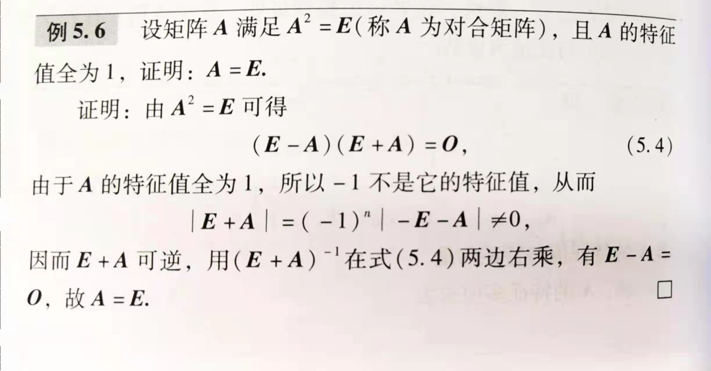

# 特征值&特征向量
## A $\alpha$ = $\lambda$ $\alpha$
* $\lambda$:A的特征值；
* $\alpha$:A对应$\lambda$的特征向量

*tip：$\lambda$$\in$F,F是复数域*

**| $\lambda$ E - A | = 0** 求$\lambda$ $\to$**特征多项式**&**特征方程**
* 复数域内n个根 $\to$$n_i$:(代数)**重数**
  
**| $\lambda$ E - A | X= 0** 的解空间：A对应$\lambda$的特征子空间 **$V_{\lambda0}$**
* $V_{\lambda0}$的维数为特征值$\lambda$0的**几何重数**

*tip:对角矩阵的特征根就是对角线上所有元素 $\to$ 特征向量：同阶单位矩阵的列向量*
*tip:行和相等的方阵：行和一定是一个特征值 特征向量：全1列向量*

## 性质
### 1.$\sum_{j=1}^{n} \lambda_j=\sum_{i=1}^{n}a_{ii}=tr(A)$
### 2.$\prod_{j=1}^{n}\lambda_j=|A|$
> 用特征多项式零点式+化简打开证(韦达？) 略

| 矩阵 | 特征根 | 特征向量 |
| --- | --- | --- |
| $A^{T}$ | $\lambda$ | |
| kA | k$\lambda$ | $\alpha$ |
| $A^{m}$ | $\lambda^{m}$ | $\alpha$ |
| g(A) | g($\lambda$) | $\alpha$ |
| $A^{-1}$ | $\lambda^{-1}$ | $\alpha$ |
| $A^{*}$ | $\lambda^{-1}\cdot$\|A\| | $\alpha$ |
> 证明略

*tip:**几何重数 r$\le$代数重数 k***

### 3.不同特征值对应的不同特征向量(组)线性无关

证明：考虑方程组$\sum_{i=1}^{s}x_i\alpha_i$=0
依次左乘A,$A^{2}$...$A^{s-1}$ 化简矩阵形式
得到det(系数矩阵)为范德蒙德行列式
$$
\begin{bmatrix}
1 & \lambda_1 & \cdots & \lambda_1^{s-1} \\
1 & \lambda_2 & \cdots & \lambda_2^{s-1} \\
\vdots & \vdots & \ddots & \vdots \\
1 & \lambda_s & \cdots & \lambda_3^{s-1} \\
\end{bmatrix}
$$ 
det(B)=$\prod_{1\le j<i\le s}\lambda_i - \lambda_j \ne$  0
B可逆 $\to$ 同右乘$B^{-1}$ $\to$ $x_i \alpha_i$=0 $\to$ 只有零解

---
#相似矩阵

> $P^{-1}AP=B$ $AB$方阵相似 $A\sim B$
### 性质
相同特征多项式(化简一下) 相同特征值 相同行列式和迹(见前)
 - [x] $A\sim B$则AB可逆且 $A^{-1}\sim B^{-1}$ 
* $g(A)\sim g(B)$

*tip:复数域上n阶方阵A存在复数域上三角矩阵B与其相似*

### 相似对角阵
* 条件 A有n个线性无关的特征向量
> AP=PB B($\lambda_i$)为对角阵 把P按列$\alpha_i$展开 A整体乘进去
> $A\alpha_i=\lambda_i \alpha_i$
* 情况:n个不同的特征值 或$m_i=n_i$(几何重数=代数重数)

#### 正交矩阵与实对称矩阵的相似对角阵
>证明：取共轭
* 实矩阵的特征值全是实数
* 正交矩阵 $A^TA=E$ (A为实矩阵)

性质 略

* 实正交阵的行(列)向量两两正交
> 拆开与转置相乘为E即得
* 特征值为±1
- [ ] Q5.14
- [ ] 例5.15

---
## 特征值&特征向量

### 性质

>补充特征子空间证明

## 相似矩阵&矩阵的对角化

>取一对特征 数学归纳法

## 实矩阵的相似对角化与正交
### 正交
>证明：利用$A^T=A$构造各种转置和共轭的异化解等式

>

