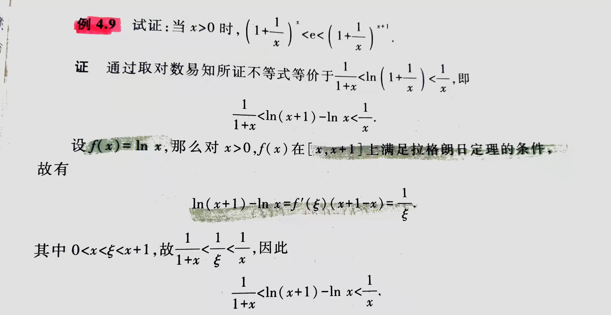
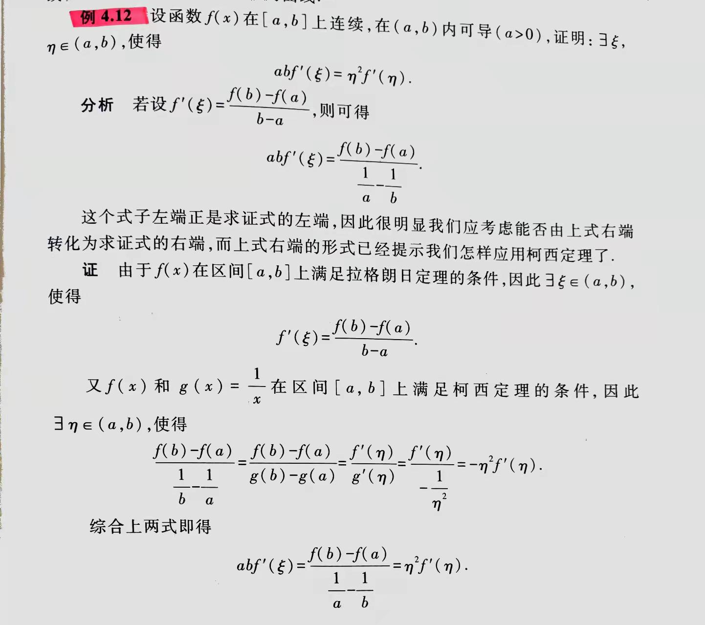

- [ ] 极值点不一定连续
- [ ] 端点不能为极值
- [ ]

- [ ]

## 费马定理：
若$x_0$为极值点且导数存在 $f'(x_0)=0$(驻点)

## 罗尔定理
若$f \in C[a,b] \cap D(a,b) ,f(a)=f(b)$
$\exist \epsilon \in (a,b) : f'(\epsilon)=0$
* 推广：自己选点

## 拉格朗日定理
若$f \in C[a,b] \cap D(a,b)$
$\exist \epsilon \in (a,b) : f'(\epsilon)=\displaystyle\frac{f(b)-f(a)}{b-a}$
> 构造罗尔定理

### 拉格朗日中值公式
$f(b)-f(a)=f'(\epsilon)(b-a)$

### 有限增量公式
$f(x_0+\Delta x)-f(x_0)=f'(x_0+\theta \Delta x)\Delta x,\theta\in(0,1)$

## 柯西定理
若$f,g \in C[a,b] \cap D(a,b), \forall x\in(a,b):g'(x)\ne 0$
$\displaystyle{\frac{f(b)-f(a)}{g(b)-g(a)}=\frac{f'(\epsilon)}{g'(\epsilon)}}$

## 达布定理
若$f\in D[a,b], f'_+(a)<f'_-(b) : \forall c\in (f'_+(a),f'_-(b)) ,\exist\epsilon\in(a,b):f'(\epsilon)=c$

---
# 洛必达(L' Hospital)法则
---
- [ ] 极限有定义，两者均可导 才能用!
- [ ] 先化简！！！！！！！！！！！！！！！
$\frac00,\frac{\infty}{\infty}(\frac x \infty),\infty \cdot\infty,0\cdot\infty,1^\infty,0^0$

---
# 泰勒公式
---
## 泰勒多项式
$P_n(x)=\sum_{k=0}^n\displaystyle\frac{f^{(k)}(x_0)}{k!}(x-x_0)^k$

## 佩亚诺(Peano)余项
+$o((x-x_0)^n)$

## 拉格朗日余项
$\displaystyle\frac{f^{(n+1)}(\epsilon)}{(n+1)!}(x-x_0)^{(n+1)}$

