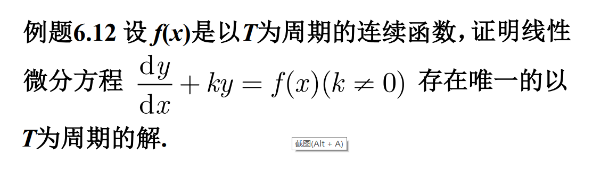
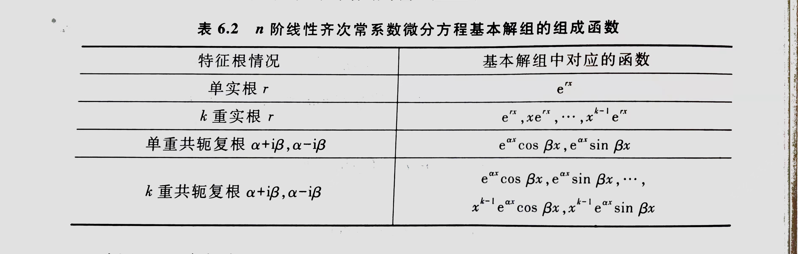

$dx^2$
*概念：*
*微分方程：连接自变量，未知函数，导数*
*常微分方程：未知函数是一元函数*
*阶；解；通解；特解；定解；定解问题/泛定问题；柯西(初值)问题；积分曲线(族)*
*齐次：无常数项； 线性：都1次； 半线性：导数一次，函数多次*

##  一阶微分方程
**$F(x,y,y')=0$**

**$y'=f(x,y)$**

**$P(x,y)dx+Q(x,y)dy=0$**

### 可分离变量方程
* **$\frac{dy}{dx}=\varphi(x)\psi(y)$**

  转化为$\frac{1}{\psi(y)}dy=\varphi(x)dx$
  积分 $\int \frac{1}{\psi(y)}dy=\int \varphi(x)dx + C$
  *tip:注意$\psi(y)=0$的情况也可能是解(**奇解**)*
  *tip:$\varphi \psi$需连续*
  *tip:注意 变上限积分中可能有**隐含**的定解条件*

### 齐次微分方程和其他化为可分离变量形式的方程
*ps:此齐次非彼齐次*

* **$y'=g(\frac{y}{x})$**
  令y=xu 求导 y‘=u+xu' 代入 得到可分离变量方程
  **$\displaystyle\frac{du}{g(u)-u}=\displaystyle\frac{dx}{x}$**
  求解然后代回去

* **$y'=f(ax+by+c)$**
  令u=ax+by+c 求导 $\displaystyle\frac{du}{dx}=a+by'=bf(u)+a$
- [x] 例6.7

* **$y'=f(\displaystyle\frac{a_1x+b_1y+c_1}{a_2x+b_2y+c_2})$**
  * $c_1=c_2=0$
    齐次：右边同除x
  * $\frac{a_1}{a_2}=\frac{b_1}{b_2}$ 
    令$u=a_1x+b_1y$
  * $\frac{a_1}{a_2}\ne \frac{b_1}{b_2}$ 
    $$
    \begin{cases}
    a_1x+b_1y+c_1=0 \\
    a_2x+b_2y+c_2=0 \\
    \end{cases}
    $$   求出其解($x_0,y_0$)
    换元 $X=x-x_0,Y=y-y_0$ 转化为齐次

---
### 一阶线性微分方程
**$y'+P(x)y=Q(x)$**
*PQ连续；Q(x): 非齐次项/自由项*
#### **常数变易法**
$Q(x)=0$: 可分离变量方程
$Q(x)\ne 0$:==假设解的形式$y=C(x)e^{-\int P(x)dx}$==
  代入原方程，得$\displaystyle\frac{dC}{dx}=Q(x)e^{\int P(x)dx}$
  解出C 并代入假设式子，得
  **一阶线性方程的通解公式$y=e^{-\int P(x)dx}(\int Q(x)e^{\int P(x)dx}dx+C)$**
  *注意这里的通解是一个特解与齐次方程的通解之和*

#### **积分因子法**
  **积分因子：$e^{\int P(x)dx}$**
  $Q(x)\ne 0$:两边同乘积分因子 化简得$(e^{\int P(x)dx}y)'=e^{\int P(x)dx}Q(x)$
  两边积分可得通解

* 伯努利方程
  $y'+P(x)y=Q(x)y^{a}$ ($a\ne 0,1$)
  令$p=y^{1-a}$ 构造一阶线性

* 一阶微分方程的其他解法
* 求出齐次方程的一个特解u(x) 令y=uv 求导代入 （刚好有一项能消掉）
* 全微分方程/积分因子 构造导数
  

---
## 一些可降解的高阶微分方程
$y^{(n)}=f(x)$ 逐次积分
$y''=f(x,y')$ 令$p(x)=y'$
$y''=f(y,y')$
> 令$y'=p(y)$ *注意！！！！*
> $y''=\frac{dp}{dy}\cdot\frac{dy}{dx}=p\cdot\frac{dp}{dy}$
> 代入 解出p是以y为自变量的一阶方程

---
## 线性微分方程解的结构
  $y^{(n)}+p_1(x)y^{(n-1)}+\cdots+p_n(x)y=f(x)$
*叠加原理* *基本解组(线性无关)*
$y=C_1y_1+C_2y_2$

###  刘维尔(Liouville)公式
设$y_1$是方程(HL)的非零解，则 **$y_2(x)=y_1 \int\displaystyle\frac{1}{y_1^{2}}e^{-\int p(x)dx}dx$**
> 常数变易法 令 $y_2=c(x)y_1(x)$ 求导代入(消0) 得出c的可分离变量方程

* 线性非齐次方程(NHL)
  $y=y^*(x)+C_1y_1(x)+C_2y_2(x)$

*  求特解$y^*$
常数变易法：令$y^*=c_1(x)y_1(x)+c_2(x)y_2(x)$
为了简便计算 不妨令**$c_1'(x)y_1+c_2'(x)y_2=0$**
求导代入并于上式联立

## 常系数线性微分方程
### 常系数线性齐次方程
  y''+py'+qy=0  //以二阶为例
> 令$y=e^{rx}$
> $r^2+pr+q=0$  //特征方程
> $r_1$,$r_2$ 特征根
> 无根视重数为0
> 
| 根的重数 | 解 | 通解 | 
| --- | --- | --- |
| 2 | $e^{r_1x}$,$e^{r_2x}$ | $y=C_1e^{r_1x}+C_2e^{r_2x}$ |
| 1 | $e^{rx}$ (用刘维尔求得另一根$xe^{rx}$)|  $y=C_1e^{rx}+C_2xe^{rx}$ |
| 0($\alpha ± i\beta$) |$e^{ax}(cos\beta x ± i sin \beta x)$ | $y=C_1e^{\alpha x}cos \beta x+C_2e^{ax}sin \beta x$ |
* 欧拉公式
* 

### 常系数线性非齐次方程
y''+py'+qy=f(x)
* $f(x)=g_m(x)e^{\lambda x}$
  令$y=x^kF_m(x)$ //k为$\lambda$作为特征方程解的重数 $F_m(x)为一个m次多项式$

* $f(x)=[P(x)cos \beta x +Q(x)sin \beta x]e^{\alpha x}$
  分开求，共轭相消
  $y^*=x^k[A(x)cos \beta x+B(x) sin \beta x]e^{\alpha x}$

### 欧拉方程
以二阶为例$x^2y''+pxy'+qy=0$
* M1：设$y=x^\lambda \to (\lambda-1)\lambda+p\lambda+q=0$
* M2：设$x=e^t \to y'=\displaystyle\frac{1}{x}\cdot\displaystyle\frac{dy}{dt}$ $y''=\displaystyle\frac{1}{x^2}(\displaystyle\frac{d^2y}{dt^2}-\displaystyle\frac{dy}{dt})$
  引进$D=\displaystyle\frac{d}{dt}$ $\to$ $[D(D-1)+pD+q]y=0$
  最后带回x，对于x<0的情况最后判断或代$-e^t$

非齐次求特解也是根据常数项设$x=e^t$

