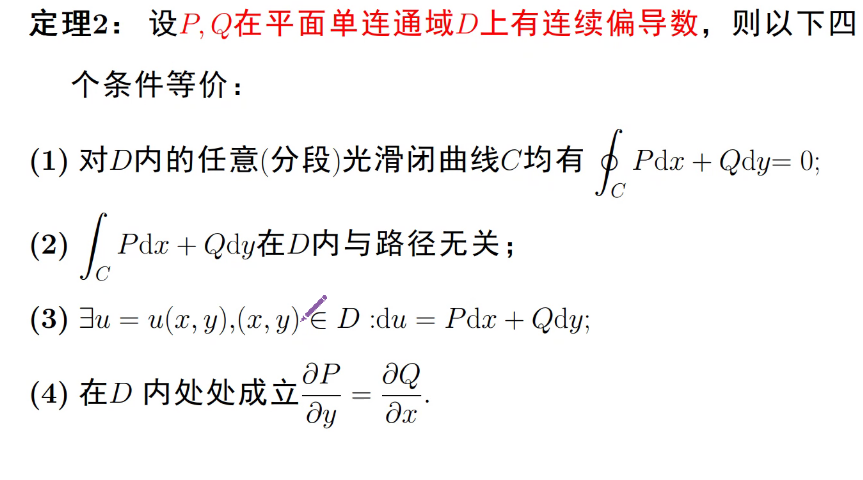

# 第一类
无方向性

## 第一类曲线积分

$\int_Cf(x,y)ds=\int_{\alpha}^\beta f(x(t),y(t))\sqrt{x'^2(t)+y'^2(t)}dt$

> 单参数形式

## 第一类曲面积分

* $z=z(x,y)$
$\iint_c f(x,y,z)ds=\iint_{D_{xy}}f(x,y,z(x,y))\sqrt{1+z_x^2+z_y^2}dxdy$

* $x=x(u,v)$
  * $\iint_c f(x,y,z)ds=\iint_{D_{uv}}f(x(u,v),y(u,v),z(u,v))\sqrt{EG-F^2}dudv$
  > $E=r_u \cdot r_u...$
  * $\iint_c f(x,y,z)ds=\iint_{D_{uv}}f(x(u,v),y(u,v),z(u,v))\sqrt{A^2+B^2+C^2}dudv$
  > $A=\frac{\partial(y,z)}{\partial(u,v)},...(x,y,z)轮换$
  * or $r=r(u,v)=(x(u,v),y(u,v),z(u,v)),(A,B,C)=r_u \times r_v,dS=|r_u \times r_v|dudv$
> *关键在于积分函数的转换*

## 第二类曲线积分

用一个变量表示出曲线带进去即可

## 第二类曲面积分(通量积分)

> 双侧曲面：法向量转一圈回来后不变

$n^0=\displaystyle\frac{\pm 1}{\sqrt{1+z_x^2+z_y^2}}(-z_x,-z_y,1)$

$\iint F(x,y,z) \cdot n^0 dS=\iint P(x,y,z)dydz+Q(x,y,z)dzdx+R(x,y,z)dxdy$

> 慎用对称性

* $z=z(x,y)$
  $\iint P(x,y,z)dydz+Q(x,y,z)dzdx+R(x,y,z)dxdy=\pm \iint (-Pz_x-Pz_y+R)dxdy$
  代入即可，注意正负

* $x=x(u,v),y=y(u,v),z=z(u,v)$
  $\iint_{\sum} D\cdot dS=\pm\iint_D (PA+QB+RC) dudv$

  $r_u\times r_v=(A,B,C)$

  $\pm $与$(A,B,C)$和定侧想对应

* 三个坐标面分别投影计算
  略
 
# Green 公式
> 单连通/复联通
> 连续偏导数！+闭曲线+正方向

$\oint_{C^+}Pdx+Qdy=\iint_D(\displaystyle\frac{\partial Q}{\partial x}-\displaystyle\frac{\partial P}{\partial y})dxdy$
> 挖 补 围

## 平面区域的面积公式
$A_D=\iint_D dxdy=-\oint_{C^+}ydx=\oint_{C^+}xdy=\frac1 2\oint_{C^+}xdy-ydx$

## 平面曲线积分与路径的无关性

## 全微分求积
> 先验证$Q_x=P_y$

$du=Pdx+Qdy$
$u(x,y)=\int_{(x_0,y_0)}^{(x,y)}Pdx+Qdy$
$\int_A^B Pdx+Qdy=u(B)-u(A)$
### 计算
* 曲线积分法
* 偏积分法 //两边单独积分
* 凑积分法 //凑成一堆积分加加减减

### 全微分方程
$Pdx+Qdy=0$
通解 $u(x,y)=c$
> 积分因子

## Gauss 公式
$\oiint_{S+}Pdydz+Qdzdx+Rdxdy=\iiint_{\Omega}=(\displaystyle\frac{\partial P}{\partial x}+\displaystyle\frac{\partial Q}{\partial y})+\displaystyle\frac{\partial R}{\partial z}dV$

### 体积计算公式
$V=\frac 1 3 \oiint_{S+}xdydz+ydzdx+zdxdy$

### 散度
$div F=\frac{\partial F}{\partial x}+ \frac{\partial F}{\partial y}+\frac{\partial F}{\partial z}$
### Stokes 定理
$\oint_{\partial \Sigma+}Pdx+Qdy+Rdz=\iint_{\Sigma}(\displaystyle\frac{\partial R}{\partial y}-\displaystyle\frac{\partial Q}{\partial z})dydz+(\displaystyle\frac{\partial P}{\partial z}-\displaystyle\frac{\partial R}{\partial x})dzdx+(\displaystyle\frac{\partial Q}{\partial x}-\displaystyle\frac{\partial P}{\partial y})dxdy$

### 旋度
> rot/cult

$(\displaystyle\frac{\partial R}{\partial y}-\displaystyle\frac{\partial Q}{\partial z},\displaystyle\frac{\partial P}{\partial z}-\displaystyle\frac{\partial R}{\partial x},
\displaystyle\frac{\partial Q}{\partial x}-\displaystyle\frac{\partial P}{\partial y})$

## 总结
$\int_{\partial \Sigma}u=\int_{\Sigma}du$