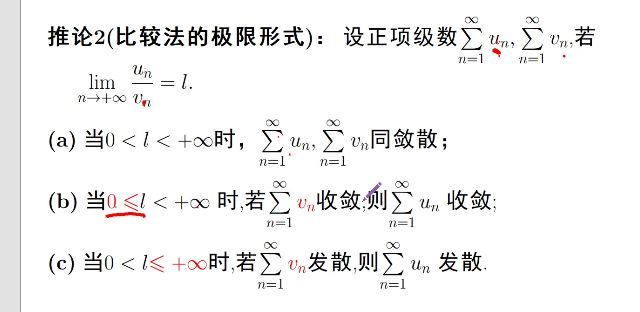
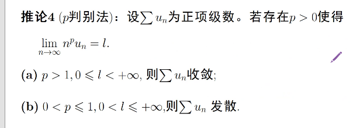
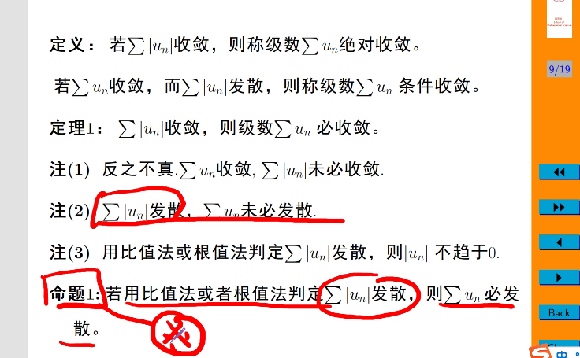
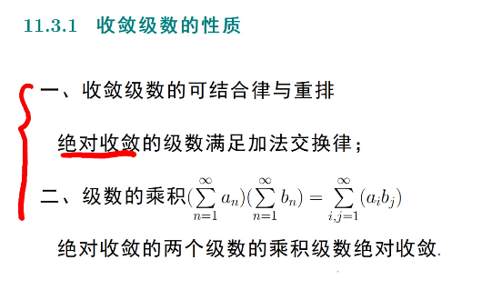
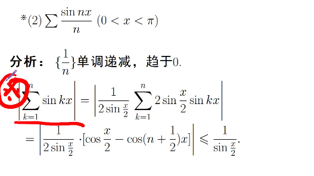
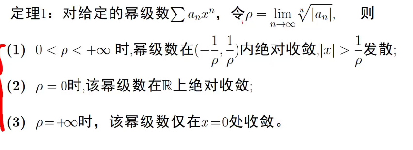
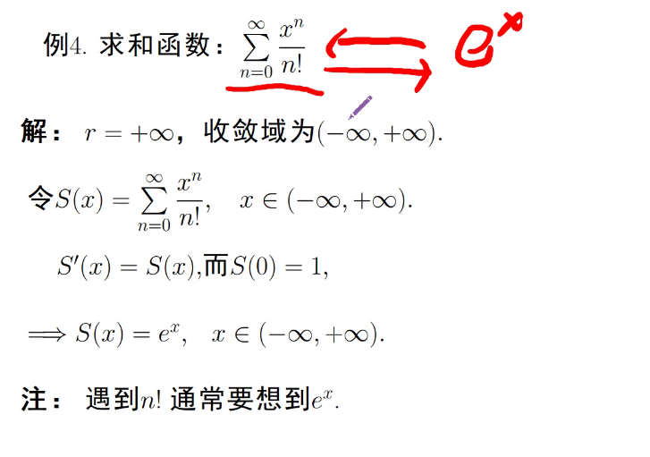

# 定义
> 无穷和

前n项部分和 + 余项级数
收敛/发散
判断发散
> 列项 公式 放缩 定理2/3的逆否命题

# 性质

* 添加/除去有限项不影响敛散性
* $\lim_{n\to\infty}a_n=0$

* 收敛的级数任意加括号后仍收敛且和不变
* 线性性

## 正项级数
收敛=部分和数列有上界

> 化为积分

- [ ] 例11.7

### 比较判别法
略

> 变形 取p

### 比值判别法
$\lim_{n\to \infty}\displaystyle\frac(a_(n+1))(a_n)=l$
$0 \le l<1$ 收敛
$l>1$ 发散

> 别忘了lim

### 比值判别法
$\lim_{n\to \infty}\sqrt[n]{a_n}=l$
$0 \le l<1$ 收敛
$l>1$ 发散

> 充分非必要
> 比值/根值判断绝对值后发散则原级数发散

### 积分判别法
$f(x)$ 非负 递减$(x>=1)$ $a_n=f(n)$ 级数与反常积分同敛散

## 交错项
> 绝对收敛 条件收敛
### Leibniz判别法
递减+极限为0
> 
> 
Cauchy

### A-D 判别法
> 形如$\sum_{n=1}^{+\infty} a_nb_n$

* Abel $a_n$单调有界 $b_n$收敛
* Dirichlet $a_n$单调收敛于0 ， $b_n$部分和有界

## 函数项级数

> 收敛点/发散点/收敛域
> 和函数
$\sum u_0(x) \to S(x)$\$\sum u_0(x) = S(x)$

## 幂级数

收敛半径，单独判断收敛区间的端点

* Abel 定理
### 幂级数的分析性质
幂级数，导数级数，积分级数 具有相同的收敛半径，收敛域不一定
连续性 ： 求和和求极限可交换顺序
逐项可导性 ： 求导和求极限可交换顺序
逐项可积性 ： 求积分和求极限可交换顺序

用幂级数算普通级数
$\sum_{n=0}^(+\infty) x^n=$

## taylor级数
某邻域内任意阶可导

余项趋近于0的范围为收敛域，可展开为幂级数
n阶导数有界
运用分析性质
* 变换
* 微分方程