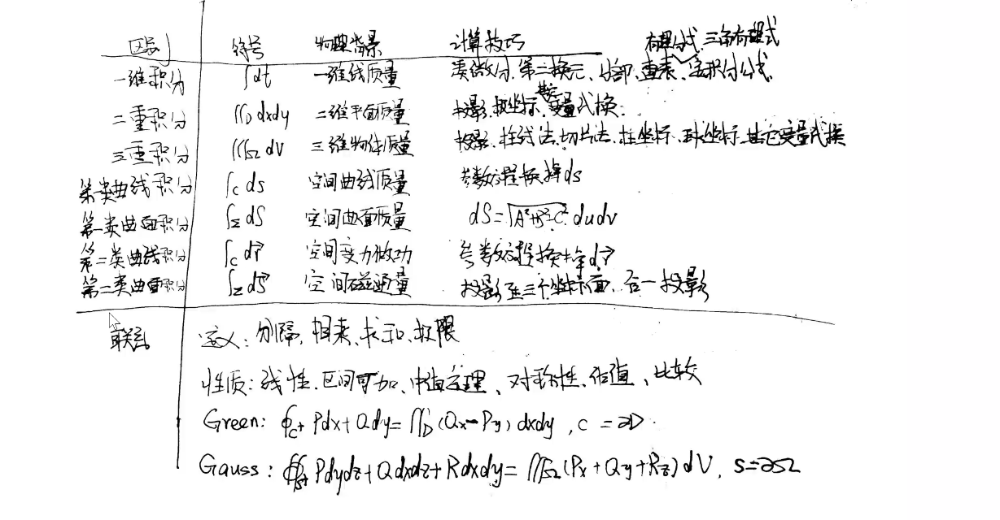
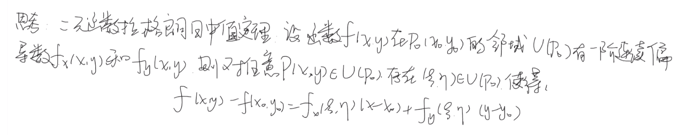
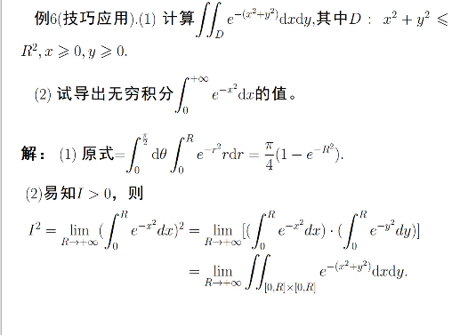
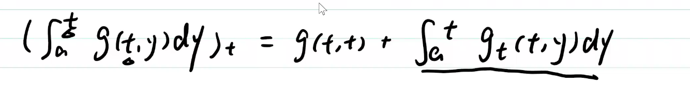

## 性质
>线性/可加/保序/

### 积分中值定理

$\iint_Df(x,y)g(x,y)d\sigma=f(\epsilon,\eta)\iint_Dg(x,y)d\sigma$

## 计算

转化成二次积分

### 技巧

>积分换序/区域划分/对称性质(区域/奇偶/轮换)/变量替换/补

* 变量替换
  $\iint_Df(x,y)dxdy=\iint_{D'}f(x(u,v),y(u,v))|\displaystyle\frac{\partial(x,y)}{\partial(u,v)}|dudv$
  `D'`定限很重要！！
* 极坐标
    $\iint_Df(x,y)dxdy=\iint_{D'}f(r cos\theta,r sin\theta)|r|d\theta dr$

> 用二重积分夹逼求出定积分~

## 三重积分
* 柱线法/坐标面投影法
  $\iiint_Df(x,y,z)dV=\int_a^bdx\int_{y_1(x)}^{y_2(x)}dy\int_{z_1(x,y)}^{z_2(x,y)}dz$

* 截面法
  $\int_{h_1}^{h_2}F(z)dz=\int_{h_1}^{h_2}dz\iint_{D_z}f(x,y,z)dxdy$

### *对称性 变量代换 略*
#### 柱面坐标系
$(r,\theta,z)$
  $\iint_Df(x,y,z)dxdy=\iint_{D'}f(r cos\theta,r sin\theta,z)|r|d\theta dr dz$

> 两项平方和
#### 球面坐标系
$(\rho,\phi,\theta)$
  $\iint_Df(x,y,z)dxdy=\iint_{D'}f(\rho sin\phi cos\theta,\rho sin \phi sin\theta,\rho cos \phi)\rho^2 sin \phi d \rho d \phi d\theta $

> 三项平方和
> 注意 $\phi$ 是与z轴夹角

# 应用
## 曲面面积
* $z=f(x,y)$
$\bold{n}=\{z_x,z_y,-1\}$
$\bold{n^0}={cos\alpha , cos \beta , cos \eta}=\displaystyle\frac{\{z_x,z_y,-1\}}{\sqrt{1+z_x^2+z_y^2}}$
$S=\iint_D \sqrt{1+z_x^2+z_y^2}dxdy $

* $x=x(u,v),y=y(u,v),z=z(u,v)$
  $S=\iint_D \sqrt{EG-F^2}$

  $r=r(u,v)=r(x(u,v),y(u,v),z(u,v))$

  $n=r_u \times r_v=(A,B,C)$

  $s=\iint_{D_{uv}}\sqrt{A^2+B^2+C^2}dudv$
  
  > $\displaystyle\frac{\partial(y,z)}{u,v}(A),\displaystyle\frac{\partial(z,x)}{u,v}(B),\displaystyle\frac{\partial(x,y)}{u,v}(C)$至少一个非0，S为光滑曲面

