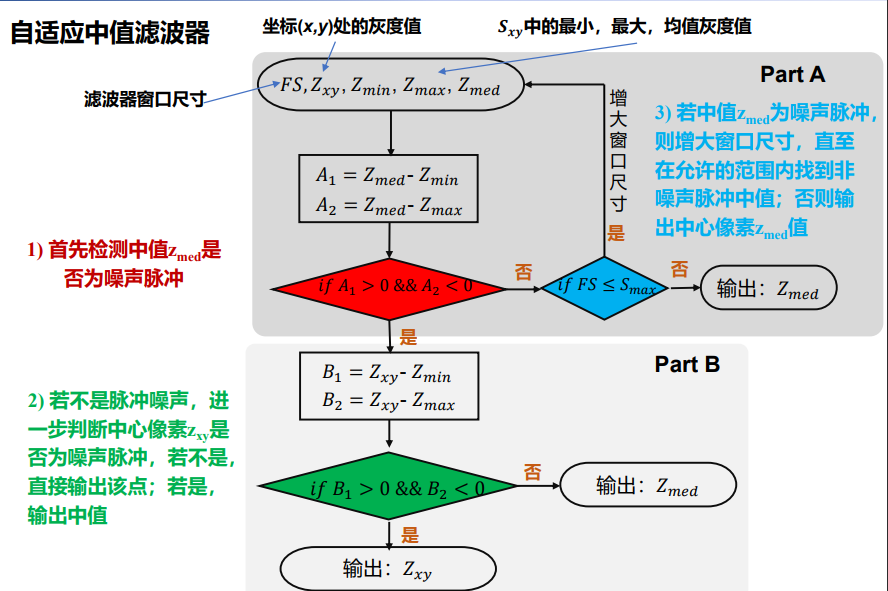

## 1. 图像基础
### 1.1. 医学成像
* 清晰度排序: CT>MRI>PET
pet分辨率低
mri软组织清晰
#### 1.1.1. PET/SPECT
> gamma 射线
* 放射性核素-正电子-湮灭
功能
#### 1.1.2. CT
> x-ray

结构
* 不同组织吸收程度不同
* 接收透过的x射线-转变为可见光-光电转换-模数转换
#### 1.1.3. 荧光显微镜
> 紫外线
#### 1.1.4. 温度检测/人脸识别
> 红外线
#### 1.1.5. MRI
> 无线电波

无电离辐射,有 射频热效应-软组织
* 特定频率的射频脉冲-氢质子磁共振-弛豫过程产生MR信号
### 1.2. 视觉
> 人眼感知亮度不是光强度的简单函数
* 亮度适应
* 亮度辨别
### 1.3. 数字图像
#### 1.3.1. 取样和量化

* 取样精度:单位距离线对数/单位距离点数`dpi`(dots per inch)
* 空间分辨率:=视场(目标图像的大小)/点数
* 量化精度:灰度级数$L=2^k$, $f(x,y)\in [0,L-1]$
* 灰度比特`k`, 动态范围:灰度跨越的值域, 饱和度: 灰度最大值(超过被裁减), 对比度: 最高与最低灰度级之间的灰度差
 
#### 1.3.2. 图像内插
> 放大/收缩/旋转/几何校正
* 已知估计未知
* 最近邻(周围四个点)/双线性(周围四个点)/双三次(周围4*4)

#### 1.3.3. 邻接性
* 4邻域$N_4(p)$/对角邻域$N_D(p)$/8邻域$N_8(p)$/m邻域(4邻接or对角邻接and4邻域交集全部非值域内)
* 邻接性 = 像素位置的邻接性 + 像素灰度值的邻接性(*要先定义值域*)
* -连通性:通路/闭合通路/连通分量/连通集-> 区域/边界/前景/背景

#### 1.3.4. 距离
* 欧氏距离`Euclidean` $D_e(x,y)=\sqrt{(x-s)^2+(y-t)^2}$
* 城市街区距离`Manhattan` $D_4(x,y)=|x-s|+|y-t|$
* 棋盘距离 $D_8(x,y)=max(|x-s|,|y-t|)$
* 明可夫斯基距离`Minkowski` $d(x,y)=\sqrt[q]{|x_1-y_1|^q+\cdots}$
* 马氏距离`Mahalanobis`$d(x,y)=\sqrt[q]{\omega_1|x_1-y_1|^q+\cdots}$
> 非负性(仅相同点间为0)/互换性$D(p,q)=D(q,p)$/$D(p,q)\le D(p,x)+D(x,q)$

### 1.4. 噪声（来源与背景）
#### 1.4.1. 随机噪声
* 高斯噪声
> 自身噪声/传感器过热/视场不够明亮

$p(z)=\frac{1}{\sqrt{2\pi}\sigma}e^{-(z-\mu)^2}/2\sigma^2$
* 泊松噪声
* 乘性噪声
* 椒盐噪声
> 感应器干扰
* 瑞利噪声
> 雷达波段

`PDF`略,不想记了, 考到算我输
* 伽马噪声
> 激光成像
$b=1$ 指数分布噪声

* 均匀分布噪声
> 量化误差
#### 1.4.2. 周期噪声
## 2. 图像分析方法
### 2.1. 空间域
#### 2.1.1. 点运算增强
##### 2.1.1.1. 阈值变换
##### 2.1.1.2. 灰度反转
> 增强嵌入在一幅图像的暗区域中的白色或灰色细节
##### 2.1.1.3. 对数变换
$s = T[r]=c log(1+r)$
* C控制最大输出灰度值
* 拉伸暗区域/压缩亮区域
应用: 傅里叶频谱的显示
##### 2.1.1.4. 伽马变换
$s = T[r]=cr^\gamma$
* $\gamma<1$ 扩展暗色灰度级-变亮
* $\gamma>1$ 扩展亮色灰度级-变暗
#### 2.1.2. 分段线性变换(点运算增强)
> 灵活, 参数复杂
##### 2.1.2.1. 对比度拉伸
> 三折曲线
##### 2.1.2.2. 灰度分层
> 突出/降低特定灰度范围
##### 2.1.2.3. 比特平面分层
> 非线性-像素比特位数抽取
#### 2.1.3. 直方图(大题)
> 只包含图像灰度分布情况，失去像素位置信息
* 概率密度函数`PDF`$=P_r(r_k)$
* 累积分布函数`CDF`$=F_r(r_k)$
##### 2.1.3.1. 直方图均衡化
> 目标函数: 单增+输入输出同一灰度范围
$s=(L-1)\int_0^rp_r(\omega)d\omega$
$s_k=(L-1)\sum_{j=0}^rp_r(r_j)$
* 非线性, 灰度级可能减少, 图像细节可能丢失, 不适用于直方图高峰图像
##### 2.1.3.2. 直方图规定化
> 可保留直方图的一般形状同时扩大某灰度范围-防止最大噪声的灰度级大大扩展

* 分别将原直方图与目标直方图均衡化-取整-对于任一$s_k$找$|v_q-s_k|$最接近0的整数$q$
##### 2.1.3.3. 局部直方图处理
#### 2.1.4. 空间滤波
> 掩模子中的值是系数值不是灰度/形状任意
> 相关/卷积(翻转)
> 相关+阈值->寻找某种特定图像
> 先平滑去噪, 再锐化
* 边界处理
  * 舍弃边缘像素点-越处理越小
  * 边缘外圈补零
  * 边缘外圈补边缘点像素值
    * replicate:补最近的边缘像素值
    * symmetric:边界对称
    * circular:补对边边界值(假设周期性)
##### 2.1.4.1. 线性滤波
###### 2.1.4.1.1. 平滑空间滤波
> 低通/所有系数为正/和为1
> 通常要求行列数为奇数以保证中心定位性能

* 盒装滤波器(所有系数相等)
  * 四邻域均值
  * 3*3均值
  * 特点: 半径越大,平滑的像素点越多,信噪比提升越大,平滑效果更好,更模糊
* 加权平均滤波器
  * 高斯
  * 特点: 保留边缘细节
$$\frac{1}{16}
 \left[
 \begin{matrix}
   1 & 2 & 1 \\
   2 & 4 & 2 \\
   1 & 2 & 1
  \end{matrix}
  \right]
$$

###### 2.1.4.1.2. 锐化空间滤波
> 高通/模板系数和为0

* 一阶算子
  对灰度阶梯有较强响应/通常产生较宽边缘/主要用于提取边缘
  * 梯度模量增强$M(x,y)=mag(\triangledown_f)=[g_x^2+g_y^2]^{1/2}$
  非线性算子,各向同性(与梯度算子$\triangledown_f=[\frac{\partial f}{\partial x},\frac{\partial f}{\partial y}]^T$比较: 线性算子,非各向同性)
  不同近似方法:
  * 基本梯度算子
$$
 \left[
 \begin{matrix}
   1 & -1\\
   0 & 0 
  \end{matrix}
  \right]
$$
$$
 \left[
 \begin{matrix}
   1 & 0\\
   -1 & 0 
  \end{matrix}
  \right]
$$
  * Roberts算子-**斜线**突出: 边缘定位准, 对噪声敏感
$$
 \left[
 \begin{matrix}
   -1 & 0\\
   0 & 1 
  \end{matrix}
  \right]
$$
$$
 \left[
 \begin{matrix}
   0 & -1\\
   1 & 0 
  \end{matrix}
  \right]
$$
  * Sobel梯度算子-**横竖线**突出
  奇数核方便卷积运算/权重2突出中心点/可能有负值or溢出灰度级需调整
  多用于工业检测/辅助人工检测缺陷/自动检测预处理
$$
 \left[
 \begin{matrix}
   -1 & 0 & 1 \\
   -2 & 0 & 2 \\
   -1 & 0 & 1
  \end{matrix}
  \right]
$$
$$
 \left[
 \begin{matrix}
   -1 & -2 & -1 \\
   0 & 0 & 0 \\
   1 & 2 & 1
  \end{matrix}
  \right]
$$
  * Prewitt梯度算子
$$
 \left[
 \begin{matrix}
   -1 & 0 & 1 \\
   -2 & 0 & 2 \\
   -1 & 0 & 1
  \end{matrix}
  \right]
$$
$$
 \left[
 \begin{matrix}
   -1 & -2 & -1 \\
   0 & 0 & 0 \\
   1 & 2 & 1
  \end{matrix}
  \right]
$$
* 二阶算子
  对细节(细线/孤立点)较强响应/对灰度阶梯产生双响应
  * 拉普拉斯算子
  负值:用0代替/统一标定
$$
 \left[
 \begin{matrix}
   0 & 1 & 0 \\
   1 & -4 & 1 \\
   0 & 1 & 0
  \end{matrix}
  \right]
$$
$$
 \left[
 \begin{matrix}
   1 & 1 & 1 \\
   1 & -8 & 1 \\
   1 & 1 & 1
  \end{matrix}
  \right]
$$

$g(x,y)=f(x,y)+\triangledown^2 f(x,y)$ 掩膜中心系数为正

* tips
  * 高提升滤波: 加系数
  * 钝化掩蔽(非锐化掩蔽):原图+(原图-平滑后模糊图像)[锐化模板]
完整保留高频成分(出版业)
##### 2.1.4.2. 非线性滤波
* 中值滤波器
  平滑去噪(椒盐噪声)
  * 对于一些细节(点/线/尖顶)多的图像不宜采用中值滤波
  * 非线性可能改变图像性质-医学不接受
* 最大值滤波器
  寻找图像中亮点/腐蚀亮区相邻的暗区
* 最小值滤波器
  寻找图像中的暗点/腐蚀暗区相邻的亮区
### 2.2. 频率域
#### 2.2.1. 傅里叶变换
* 一维
$F(\mu) =\int_{-\infty}^{+\infty} f(t)e^{-j2\pi\mu t}dt$
$f(t) =\int_{-\infty}^{+\infty} F(\mu)e^{j2\pi\mu t}d\mu$
$F(u) =\sum_{0}^{M-1} f(x)e^{-j2\pi u x/M}$
$f(x) =\frac 1 M \sum_{0}^{M-1} F(u)e^{j2\pi u x/M}$
* 二维
$F(\mu,v)=\int_{-\infty}^{+\infty}\int_{-\infty}^{+\infty}f(x,y)e^{-j2\pi(\mu x+vy)}dxdy$
$f(x,y)=\int_{-\infty}^{+\infty}\int_{-\infty}^{+\infty}F(\mu,v)e^{j2\pi(\mu x+vy)}d\mu dv$

fftshift-中间低频, 周围高频$F(u-\frac M 2,v-\frac N 2)$ 相当于$f(x,y)(-1)^{x+y}$
幅度谱/相位谱/功率谱
> 物体在空间的移动, 相当于频域相位移动
利用共轭对称进行部分傅里叶重建
* 性质
  * 可分性 $F(u,v)=\frac 1 M \sum_{x=0}^{M-1}F(x,v)e^{-j2\pi ux/M}$
  * 平均值 $\bar{f}(x,y)=\frac 1{MN}F(0,0)$
  * 对称性/周期性 $|F(u,v)|=|F(-u,-v)|$,$F(u,v)=F(u+k_1 M,v+k_2N)$
  * 卷积性 
  * 一起旋转
* 滤波
$f(x,y)(-1)^{x+y}\to F(u,v)\to H(u,v)F(u,v)\to g(x,y)(-1)^{x+y}$
#### 2.2.2. 频域图像平滑
* 理想低通滤波器
$$
H(u,v)=
\begin{cases}
 1,D(u,v)\le D_0\\
 0,D(u,v)>D_0
\end{cases}
$$
  有振铃现象/物理不可实现
* 巴特沃斯低通滤波器
  $H(u,v)=\displaystyle\frac{1}{1+[D(u,v)/D_0]^{2n}}$
  模糊程度减少,对噪声的过滤不如`ILPF`
* 高斯低通滤波器
  $H(u,v)=e^{-D^2(u,v)/2D_0^2}$
  ==推导==
  $H(u)=Ae^{-u^2/2\sigma^2} \to h(x)=\sqrt{2\pi}\sigma A^{-2\pi^2\sigma^2 x^2}$
#### 2.2.3. 频域图像锐化
* 理想高通 略
* 巴特沃斯高通
  $H(u,v)=\displaystyle\frac{1}{1+[D_0/D(u,v)]^{2n}}$
* 高斯高通滤波器
  $H(u,v)=1-e^{-D^2(u,v)/2D_0^2}$
* 频域拉普拉斯
  $\triangledown^2f(x,y)\to -[(u-M/2)^2+(v-N/2)^2]F(u,v)$
#### 2.2.4. 同态滤波
> 不均匀背景

$f(x,y)\to ln \to DFT \to H(u,v) \to IFFT \to exp\to g(x,y)$
H:适当增强高频,抑制低频
### 2.3. 形态学
> 数学基础:集合论
> 结构元:任意大小/任意性质/原点任意定义-逻辑运算
#### 2.3.1. 形态学操作
> 记住符号
> 注意反射
* 适合Fit
  结构元中所有1都重合
* 击中Hit
  结构元中任一1有重合

* 腐蚀-消除边界
  $A \ominus B =\{z|(B)_z\subseteq A\}$
* 膨胀-扩张边界
  $A \oplus B = \{z|(\hat{B})_z \cap A \ne \emptyset\}$ 注意要反射(一般使用对称结构元)

* 开运算-去除孤立小店和毛刺-平滑边界
  $A \circ B=(A \ominus B)\oplus B$
* 闭运算-填充孔洞,连接
  $A \bullet B=(A \oplus B)\ominus B$
* 击中击不中变换`HMT`-寻找相同形状
  $A \ast B_{1,2} = \{(B_1)_z\subseteq A \& (B_2)_z \subseteq A^c\}=(A \ominus B_1) \cap(A^c \ominus B_2)$
  有时取$B_2=B_1^c$

* tip: 噪声滤波器:先开后闭
* 对偶性
  $(A \ominus B)^c=A^c \oplus \hat{B}$,  $(A \oplus B)^c=A^c \ominus \hat{B}$
  $(A \circ B)^c=A^c \bullet \hat{B}$,  $(A \bullet B)^c=A^c \circ \hat{B}$

#### 2.3.2. 形态学算法（大题不考）
##### 2.3.2.1. 边界提取
$\beta(A)=A- (A\ominus B)$
B为3*3 全1结构元

*比较：空间滤波定位精度差/噪声敏感/边缘常不连续不规则*

##### 2.3.2.2. 孔洞填充
$X_k = (X_{k-1}\oplus B)\cap A^c$, $X_k=X_{k+1}$时迭代停止
$X_0$初始种子点
*必须已知一个种子点*
结构元: 四连通

##### 2.3.2.3. 连通分量提取
$X_k=(X_{k-1}\oplus B)\cap A$, $X_k=X_{k+1}$时迭代停止
结构元:3*3全1

##### 2.3.2.4. 凸壳
> 包含s的最小凸集合

$X_k^i=(X_{k-1}^i\ast B)\cup X_{k-1}^i$, $X_k^i=X_{k+1}^i$时迭代停止
$X_0^i=A$
$C(A)=\cup_{i=1}^4X_k^i$
$$B^{1\dots 4}=
 \left[
 \begin{matrix}
   1 & x & x \\
   1 & 0 & x \\
   1 & x & x
  \end{matrix}
  \right]
$$
*其他方向对应旋转*
*注意:该方法不一定保证最小凸性-设计结构元多方观察*
##### 2.3.2.5. 细化与粗化
* 细化 $A\otimes B=A-(A\ast B)$
连续使用$B^1,B^2,\dots,B^n$对A进行细化直至不再改变
$$B^{1\dots 8}=
 \left[
 \begin{matrix}
   0 & 0 & 0 \\
   x & 1 & x \\
   1 & 1 & 1
  \end{matrix}
  \right]
$$
*其他方向对应旋转45°*

* 粗化 $A \odot B=A \cup (A\ast B)$
可通过对补集细化实现-要删除断点
##### 2.3.2.6. 骨架(不考)
> 最大圆盘圆心轨迹

$S(A)=\cup_{k=0}^KS_k(A)$

$S_k(A)=(A\ominus kB)-(A\ominus kB)\circ B$//连续腐蚀k次, k为腐蚀至空集前的最后一次迭代
重建$A=\cup_{k=0}^K(S_k(A)\oplus kB)$
*需要通过骨架子集重建，只有一个无法恢复*
结构元:3*3全1

##### 2.3.2.7. 裁减(不考)
多次细化删除毛刺-从端点开始膨胀(次数小于要删除的端点数)-与细化结果交集
#### 2.3.3. 灰度级形态学（大题）
> 不平坦结构元:数值为灰度值
> 结果灰度级发生变化
* 腐蚀/膨胀
  * 平坦结构元
  $[f \ominus b](x,y)=\min_{(s,t)\in b}\{f(x+s,y+t)\}$
  $[f \oplus b](x,y)=\max_{(s,t)\in b}\{f(x-s,y-t)\}$
  * 非平坦结构元
  $[f \ominus b](x,y)=\min_{(s,t)\in b}\{f(x+s,y+t)-b(s,t)\}$
  $[f \oplus b](x,y)=\max_{(s,t)\in b}\{f(x-s,y-t)-\hat{b}(s,t)\}$
  * 对偶性
  注意`hat`和符号，$f^c=-f$
* 开运算/闭运算-与前文一致
  开运算和闭运算的几何解释
  一般认为, 开运算对图像中暗特征和背景的影响可忽略不计, 亮特征变小

##### 2.3.3.1. 灰度级形态学算法
* 形态学平滑与去噪
  先开后闭
* 形态学梯度
  $g=(f\oplus b)-(f\ominus b)$
  可产生'类导数'梯度效果，用于描绘区域边界
* 顶帽变换底帽变换
  * 白顶帽变换 $T_{hat}(f)=f-(f \circ b)$ 
  * 黑底帽变换 $B_{hat}(f)=(f \bullet b)-f$
  删除物体/不均匀光照
* **粒度测定**
  依次使用尺寸不断增大的结构元进行开运算-所有像素灰度级求和-反应颗粒大小分布
* **纹理分割**
  闭运算(删除小斑点)-开运算(融合大斑点)-梯度+叠加
  
## 3. 问题分类
### 3.1. 图像增强
> 提高图像质量(去除噪声/提高清晰度)
> 处理后更适合某应用-主观, 不估计图像退化过程

* 对比度增强
  * 灰度变换
  * 直方图
* 去噪
  * 空间域平滑
  * 频率域平滑
* 边缘锐化
  * 空间域锐化
  * 频率域锐化
* 矫正不均匀背景
  * 同态滤波
### 3.2. 图像分割
#### 3.2.1. 区域间不连续性

##### 3.2.1.1. 边缘检测
* 孤立点检测
空间拉普拉斯算子, 设定阈值T
$$
 \left[
 \begin{matrix}
   -1 & -1 & -1 \\
   -1 & 8 & -1 \\
   -1 & -1 & -1
  \end{matrix}
  \right]
$$
* 空间拉普拉斯算子线检测-各向同性(噪声敏感,通常不单独使用)
  正负双线的处理:绝对值/只取正值/噪声时取阈值
* 规定线方向检测
$$
 \left[
 \begin{matrix}
   -1 & -1 & -1 \\
   2 & 2 & 2 \\
   -1 & -1 & -1
  \end{matrix}
  \right]
$$
*四个方向均类似-系数和为0/感兴趣的方向系数大*
* 基于梯度算符
  一阶:基本梯度算子/Roberts/Sobel/Prewitt
  梯度幅度$M(x,y)=\sqrt{g_x^2+g_y^2}=|g_x|+|g_y|$
  梯度方向$\alpha(x,y)=\arctan [g_x/g_y]$
  边缘方向$\phi=\alpha(x,y)-90$
  梯度算子+均值滤波+阈值处理
* 基于过零点(LoG)Laplacian-Gauss算子边缘检测-Marr-Hildreth算法
  Gausssian滤波器+Laplacian边缘检测(墨西哥草帽函数)
  ==推导==
  $LoG=\triangledown^2G(x,y)=\displaystyle\frac{\partial^2G(x,y)}{\partial x^2}+\frac{\partial^2G(x,y)}{\partial y^2}=[\frac{x^2+y^2-2\sigma^2}{\sigma^4}]e^{-\frac{x^2+y^2}{2\sigma^2}}$
  系数和为0(平坦区域无响应)-平移
  *LoG的大小与标准差有关($\ge 6 \sigma$的最小奇数), 过大计算量大, 过小造成截断*
  需要检测零交叉定位边缘(阈值判断)
  可能产生假边缘/曲线边缘定位误差较大
* Canny算子边缘检测
  边缘检测三大准则:1.低错误率(信噪比准则)2.边缘点应该被很好的定位(定位精度准则)3.单个边缘点响应 
  高斯滤波平滑图像-计算梯度幅度和方向-非极大值抑制(消除边缘检测带来的杂散响应)-双阈值检测(确定边缘)-抑制孤立弱边缘(连通性分析)
  1.寻找最接近$\alpha(x,y)$的方向-2.若$M(x,y)$小于该方向上一个或两个邻点的幅度,则置零(非极大抑制)[...]
##### 3.2.1.2. 边缘连接
* 局部连接处理
  $M(x,y)>T_m$and$\alpha(x,y) \in [A\pm T_A]$
  记录像素连接情况，得到二值图像-扫描填充-旋转$\theta$
* 霍夫(Hough)变换(全局)
  图像空间与参数空间的对偶性
  经典霍夫变换:检测线和圆
  抗噪声能力强/预处理丢失信息
#### 3.2.2. 区域内相似性
##### 3.2.2.1. 优化阈值处理
* 基本全局阈值迭代
  选择初始阈值$T_0$(一般为灰度级均值)-分割$G_1/G_2$-分别计算区域内灰度平均值$ m_1/m_2$-新阈值$T=\frac 1 2(m_1+m_2)$-当连续两次迭代$\Delta T<\epsilon$预设参数时迭代停止
* 最大方差最佳全局阈值选取法(Otsu)
  区域内部相似性 $P_1\sigma_1^2+P_2\sigma_2^2$
  不同区域间差异性 $P_1P_2(m_1-m_2)^2$    (等价)
  无需迭代/阈值有效性可评估
  直方图概率密度函数$p_i$-累计和$P_1(k)=\sum_{i=1}^kp_i$-累计均值$m(k)=\sum_{i=0}^kip_i$-全局灰度均值$m_G=\sum_{i=1}^{L-1}ip_i$-类间方差$\sigma_B^2(k)=\frac{[m_GP_1(k)-m(k)]^2}{P_1(k)[1-P_1(k)]}$-求使其极大值的$k$(若不唯一则取平均值)
  全局方差$\sigma_G^2=\sum_{i=0}^{L-1}*(i-m_G)^2p_i$-可分离性测度$\eta^*=\frac{\sigma_B^2(k^*)}{\sigma_G^2}$
* 图像平滑改进
  目标和背景面积相差很大时效果较差
* 边缘信息改进的全局阈值处理  
  先计算梯度幅度/拉普拉斯绝对值-规定阈值T对边缘图像阈值处理得到$g_T(x,y)$-从$f(x,y)$根据$g_T(x,y)$遮罩得到模板图像,灰度直方图计算得到阈值$k^*$-以此分割原图像(减少背景大波峰的影响)
* 多阈值处理
  $\sigma_B^2=\sum_{k=1}^KP_k(m_k-m_G)^2$
* 局部分区阈值处理
  * 基于局部图像性质的可变阈值处理(平均值/方差)
  * 基于移动平均的可变阈值处理(目标尺寸较小时)
##### 3.2.2.2. 区域生长
* 选择或确定一组能代表所需区域的种子像素(人机交互/直方图峰值)
* 确定在生长过程中能将相邻像素包含进来的准则(生长或相似准则)
* 指定让生长过程停止的条件或规则(步数/像素点数/无新种子点)

##### 3.2.2.3. 区域分裂合并
* 任一区域$Q(R_i)=FALSE$,分裂成不重叠的四等分(一般使用方差最小准则)
* 对于相邻区域$Q(R_i\cup R_j)=TRUE$, 可合并
* 不能进一步分裂或合并则结束
##### 3.2.2.4. 聚类
衡量距离的方法*4
`z-score`标准化
* k-means
  * 随机选取k个初始聚类中心
  * 将每个样本归到最近的聚类中心
  * 对于每个簇取均值迭代直至不再变化/一定次数
### 3.3. 图像复原
> 估计退化过程(噪声干扰/运动模糊/几何失真/辐射失真)-客观-提高图像保真度

退化模型 $g(x,y)=h(x,y)\ast f(x,y)+\eta(x,y)$
* 噪声模型估计
  * 直观经验
  * 先验知识
  * 理想图像
  * 退化图像(尽量取纯色快的PDF)
#### 3.3.1. 只存在噪声的图像复原
$g(x,y)=f(x,y)+\eta(x,y)$
*滤波器了解名字即可, 表达式不用记, 考点:分别消除了什么噪声*
* 均值滤波
  * 算术均值滤波器
  * 几何均值滤波器
    细节损失较少, 无法处理椒盐噪声
  * 谐波均值滤波器
    '盐'噪声处理较好, 不适用于'椒'噪声,善于处理高斯噪声
  * 逆谐波均值滤波器
    Q为正:消除'椒'噪声;Q为负:消除'盐'噪声(不可同时消除)
* 统计排序滤波器
  * 中值滤波器
    对单极或双极脉冲噪声(椒盐)有效
  * 最大值和最小值滤波器
  * 中点滤波器
    结合顺序统计和求平均, 对高斯和均匀分布有效
  * 修正的阿尔法均值滤波器
    均值和中值混合, 可处理混合噪声(如高斯+椒盐)
* 自适应滤波器
  考虑图像局部特性
  * 自适应局部降低噪声滤波器(均值)
  $\hat{f}(x,y)=g(x,y)-\frac{\sigma_\eta^2}{\sigma_L^2}[g(x,y)-m_L]$
  L:局部特征
  * 自适应中值滤波器
  改变窗口尺寸
  
  噪声去除效果与中值滤波器接近但能保持尖锐性和细节
* 频率滤波器
  * 带通滤波器
  * 带阻滤波器
  * 陷波滤波器`Notch Filters`
    阻止事先定义的中心频率邻域内的频率(必须关于原点对称/形状任一)
#### 3.3.2. 噪声与退化函数并存的图像复原

* 退化函数估计
  * 图像观测估计法
  子图像近似无噪声重建
  $H(u,v)=\frac{G_s(u,v)}{F_s(u,v)}$
  * 实验估计法
  脉冲(小亮点)的冲激响应
  $H(u,v)=\frac{G(u,v)}{A}$ 
  * 模型估计法
  原理/先验知识
  *例子都是重点*
    * 大气湍流 $H(u,v)=e^{-k(u^2+v^2)^{5/6}}$
    * 相对运动 $g(x,y)=\int_0^T f(x-x_0(t),y-y_0(t))dt$
    $G(u,v)=F(u,v)\int_0^Te^{-j2\pi[ux_0(t)+vy_0(t)]}dt$
    给定速度$x_0(t)=at/T,y_0(t)=bt/T$
    $H(u,v)=\frac T{\pi(ua+vb)}sin[\pi(ua+vb)]e^{-j\pi(ua+vb)}$
* 逆滤波
  $\hat{F}(u,v)=\frac{G(u,v)}{H(u,v)}=F(u,v)+\frac{N(u,v)}{H(u,v)}$
  噪声较小时效果好, 完全未考虑噪声的统计特征
  $H\to 0$时放大噪声
  * 设置受限半径
  * 分母+常数k
* 维纳滤波(最小均方误差)Wiener Filtering
  假设 图像和噪声均为随机信号 互不相关
  使$e^2=E\{(f-\hat{f})^2\}$
  $\hat{F}(u,v)=H_{wie}(u,v)G(u,v)$
  $H_{wie}=\displaystyle\frac{1}{H(u,v)}\frac{|H(u,v)|^2}{|H(u,v)|^2+\frac{S_\eta(u,v)}{S_f(u,v)}}$
  噪声未知:  $H_{wie}=\displaystyle\frac{1}{H(u,v)}\frac{|H(u,v)|^2}{|H(u,v)|^2+K}$
  $s_\eta$:噪声功率谱 $s_f$:未退化图像功率谱 $s_f/s_\eta$:信噪比

#### 3.3.3. 图像复原评价
> 主观/客观

相似度的测量(有参考):
* 平均绝对误差MAE
* 均方误差MSE
* 归一化均方误差NMSE
* 信噪比SNR
* 峰值信噪比PSNR
.png)
无参考
* 灰度评价梯度值GMG
* 拉普拉斯算子和方法

### 3.4. 彩色图像处理
> 多通道
### 3.5. 小波与多分辨率处理
> 小波变换常用于医学影像降噪重建
### 3.6. 图像压缩和水印
### 3.7. 特征提取/目标识别

