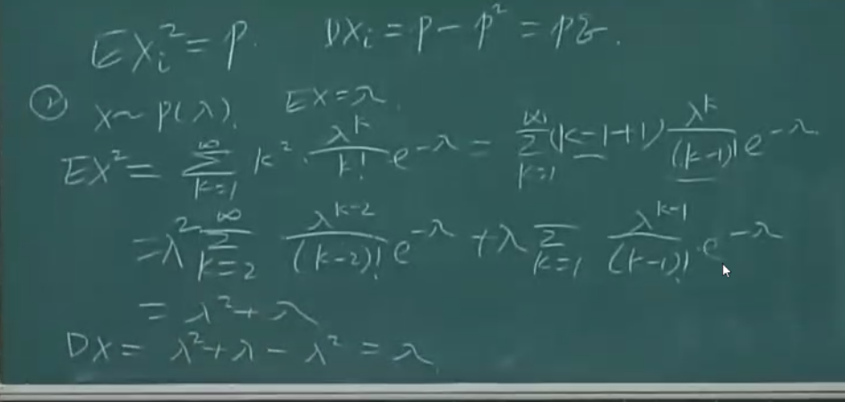
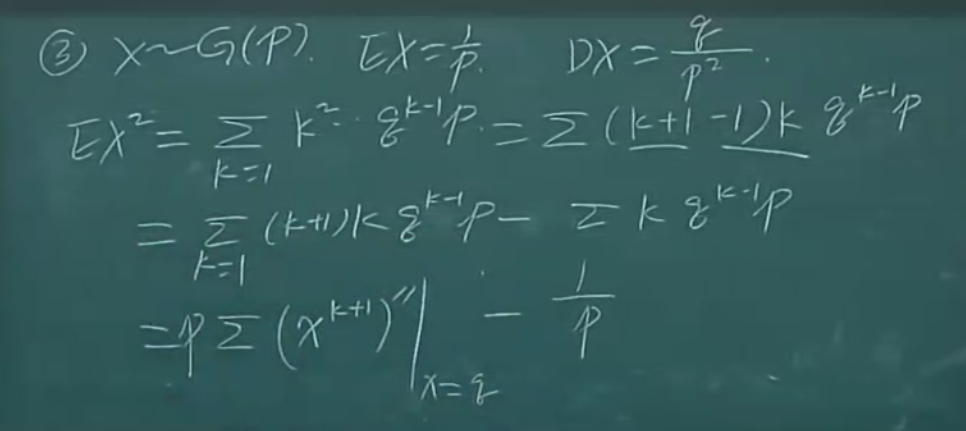
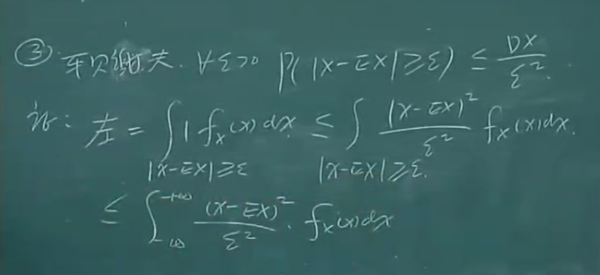
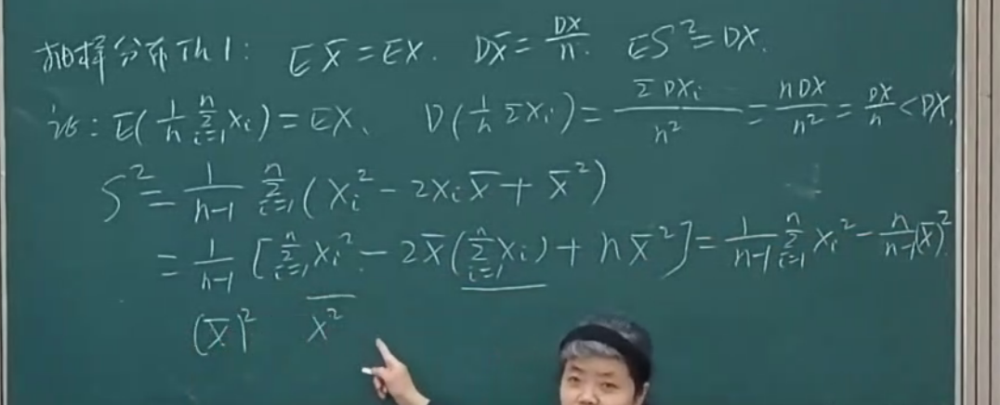
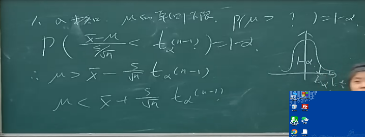

# 概率
## 概型
### 古典概型
> 有限个基本事件+可能性相同

### 几何概型
> 基本事件无数多个, 对应点

- [ ] p13 例1.2.4 Buffon投针试验
- [ ] 贝特朗奇论 取等可能的条件

- [ ] $P(A \bigcup B)P(AB) \le P(A)P(B)$ ??

## 条件概率
乘法公式 $P(AB)=P(A)P(B|A)=P(B)P(A|B)$
全概率公式 $P(A)=\sum_{i=1}^nP(B_i)P(A|B_i)$
Bayes公式 $P(B_i|A)=\displaystyle\frac{p(AB_i)}{P(A)}=\displaystyle\frac{P(B_i)P(A|B_i)}{\sum_{j=1}^{n}P(B_j)P(A|B_j)}$

## 独立性
$P(AB)=P(A)P(B)$
> 多项独立还需要加上多项相乘的条件！

---

## 离散型随机变量
> 随机变量X有限个或可列无穷多个
### 0-1分布

$P(X=k)=p^k(1-p)^{1-k},k=0,1$

### 二项分布(Bernoulli概型)

*独立 重复 两个结果*

$P(X=k)=C_{n}^{k}p^k(1-p)^{1-k},k=0,1,\cdots ,n$

* $k<(n+1)p$ : $\uparrow$
* $k>(n+1)p$ : $\downarrow$
* max: $k=[(n+1)p]$
  取整时 $(n+1)p-1$ 也取到max

### 负二项分布(Pascal分布)

- [ ]
$P(X=k)=C_{k-1}^{r-1}p^r(1-p)^{k-r},k=r,r+1,\cdots ,$

#### 几何分布

r=1 时 $P(X=k)=(1-p)^{k-1}p$

### 泊松分布(Poisson)

*无记忆性*

$X \sim B(n,\frac{\lambda}{n})$

$\lim_{n \to \infty }P(X_n=k)=\lim_{n \to \infty}C_{n}^{k}(\frac{\lambda}{n})^k(1-\frac{\lambda}{n})^{n-k}=e^{-\lambda}\frac{\lambda^k}{k!},k=0,1,2,\cdots , n$

#### Poisson 定理
- [x] 推导

$\lim_{n \to + \infty }np_n=\lambda > 0$

$\lim_{n \to + \infty }C_{n}^kp_n^k(1-p_n)^{n-k}=e^{-\lambda}\frac{\lambda^k}{k!},k=0,1,2,\cdots$
np<10!!   //不知道自己写得啥意思
#### 推广

条件不用$+\infty$ //不知道自己写得啥意思+1

### 超几何分布

*取东西不放回*

$P(X=k)=\displaystyle\frac{C_a^k C_b^{n-k}}{C_{a+b}^n}$

当$(a+b)\to \infty$ 把不放回近似于放回 $P(X=k)=(\frac{a}{a+b})^k(\frac{b}{a+b})^{n-k}$

---

## 连续型随机变量

> 存在非负可积函数 其积分=F(分布函数) 概率密度函数

> 连续型随机变量的分布函数连续

### 概率密度

$f(x)=F'(x)$

$P(x_0<X\le x_0+\Delta x)\approx f(x_0)\Delta x$

$P(X=a)=0$

> f不唯一 有限或可列点处值可突变

### 均匀分布
$$
f(x)=
  \left\{\begin{matrix} 
  \displaystyle\frac{1}{b-a},a<x<b, \\
  0,others, \\ 
\end{matrix}\right.    
$$

$$
X \sim U(a,b)
$$

$$
F(x)=
  \left\{\begin{matrix} 
  0,x<a, \\
  \displaystyle\frac{x-a}{b-a},a \le x <b, \\
  1, x \ge b, \\
\end{matrix}\right.    
$$

### 指数分布
$$
f(x)=
  \left\{\begin{matrix} 
  \lambda e ^{-\lambda x},x>0, \\
  0,x \le 0, \\ 
\end{matrix}\right.    
$$

$$
X \sim E(\lambda)
$$

$$
F(x)=
  \left\{\begin{matrix} 
  1-e ^{-\lambda x},x>0, \\
  0,x \le 0, \\ 
\end{matrix}\right.    
$$

* ps $N(t) \sim P(\lambda t) \to T\sim E(\lambda)$
 - [ ]

### 正态分布(Gauss 分布)

$f(x)=\displaystyle\frac{1}{\sqrt{2\pi}\sigma}e^{-\displaystyle\frac{(x-\mu)^2}{2\sigma^2}}$

$x \sim N(\mu,\sigma^2)$

* 性质
* max: $x=\mu$ $f=\frac{1}{\sqrt{2\pi}\sigma}$
* $\mu$:位置 $\sigma$:形状

#### 标准正态分布

> $\mu=0,\sigma=1$

分布函数
$\Phi(x)=\frac{1}{\sqrt{2\pi}}\int_{-\infty}^{x}e^{-\frac{t^2}{2}}dt$

> 查表

* 线性变换  $Y=\frac{X-\mu}{\sigma}$ 把一般正态分布转化为标准正态分布

## 其它

* 小概率原理

* 实际推断原理

### 随机变量函数

$f_Y(y)=f_X(g^{-1}(x))|g^{-1}(x)'|$
duiy求导o
多段单调就多段加起来

## 二维离散型随机变量

> 非负 规范

### 关于x/y的边缘分布律

不可通过边缘分布律确定联合分布律

## 二维连续性随机变量
> 存在可积

边缘密度函数 略

### 二维均匀分布
$$
f(x)=
  \left\{\begin{matrix} 
  \displaystyle\frac{1}{S_D},(x,y)\in G, \\
  0,others, \\ 
\end{matrix}\right.    
$$

### 二维正态分布

$$
f(x)=...
$$
$$
(X,Y)\sim N(\mu_1,\sigma_1^2;\mu_2,\sigma_2^2;\rho)
$$

$$
x \sim N(\mu_1,\sigma_1^2)
$$

$$
y \sim N(\mu_2,\sigma_2^2)
$$
> 边缘分布律与$\rho$无关

- [ ] 例3.1.6

## 条件分布
> 乘法公式 全概率公式
> 连续变量的条件分布用洛必达

$f_{X|Y}(x|y)=(\displaystyle\frac{\int_{-\infty}^{x}f(u,y)du}{f_Y(y)})'=\displaystyle\frac{f(x,y)}{f_Y(y)}$

> 积分中值定理

## 独立性
$F(X,Y)=F_X(x)F_Y(y)$

### 独立性定理
$f(x,y)=r(x)g(x)$
*meishenmejiazhi*

### n维随机变量
略

## 多维随机变量函数的分布
离散卷积公式              
$P(X+Y=r)=\Sigma_{i=0}^r P(X=i)P(Y=r-i)$

> Poisson分布，二项分布的可加性

### 和
随机变量的线性函数的分布

$Z=aX+bY+c$

$f_z(z)=\displaystyle\frac{1}{|b|}\int_{-\infty}^{+\infty}f(t,\displaystyle\frac{z-at-c}{b})dt=\displaystyle\frac{1}{|a|}\int_{-\infty}^{+\infty}f(\displaystyle\frac{z-bt-c}{a},t)dt$

### 商

$Z=\displaystyle\frac{X}{Y}$

$f_z(z)=\int_{-\infty}^{+\infty}f(yz,y)|y|dy$

### 平方和

$Z=X_1^2+X_2^2+\cdots+X_n^2$

$$
f_z(z)=  \left\{
  \begin{matrix} 
  0,z<0, \\
  \frac12 \int_0^{2\pi}f(\sqrt{z}cos \theta,\sqrt{z}sin \theta )d\theta,z\ge 0. \\ 
\end{matrix}\right.   
$$

### 极值
$P(max(x,y)<M)=\int_{-\infty}^m \int_{-\infty}^m f(x,y)=F_x(m)F_y(m)$

$P(min(x,y)<M)=1-P(min(x,y)>M)=1-(1-f_x(m))(1-f_y(m))$

### 多维随机变量函数的联合分布
$u=u(x,y), v=v(x,y)$
$f_{(U,V)}(u,v)=f_{(X,Y)}(h(u,v),s(u,v))|J(u,v)|$
> h,s 反函数 
> $J=\displaystyle\frac{\partial(h,s)}{\partial(u,v)}$

#  数字特征
p130
## 数学期望
级数$\sum_{k=1}^{+\infty}x_kp_k$ 绝对收敛

* $x\sim P(\lambda)$
  ==$E(x)=\lambda \sum_{k=1}^{+\infty}\displaystyle\frac{\lambda^{k-1}}{(k-1)!}e^{-\lambda}=\lambda$==

* $P(x=K)=pq^{k-1}$
  $E(x)=\frac{1}{p}$
  > 化成积分后等比数列求和再求导 

* $x \sim B(p)$
  $E(X)=$
  ...忘了 之后补充..
  
* $x \sim N(\mu,\sigma)$
  $E=\mu$
  > 换成标准正态分布证明

* $x \sim exp(\lambda)$
  $E=\frac{1}{\lambda}$
  > 分部积分

* $x \sim U(a,b)$
  $E=\frac{a+b}2$

## 性质见书
$E(XY)=cov(X,Y)+(EX)(EY)$
##  方差
### 性质
$D(X)=E(X^2)-[E(X)]^2$
* $D(X \pm Y) = D(X) + D(Y) \pm 2 cov(X,Y)$
* $D(aX+bY)=a^2DX+2abCov(X,Y)+b^2DY$
### 常见

* $x \sim B(n,p)$
  $D_{x_i}=pq$
  $D=npq$

* $x\sim P(\lambda)$
  ==$E(x)=\lambda \sum_{k=1}^{+\infty}\displaystyle\frac{\lambda^{k-1}}{(k-1)!}e^{-\lambda}=\lambda$==

* $X \sim G(p)$
  $E(x)=\frac{1}{p}$
  > 化成积分后等比数列求和再求导 

  
* $x \sim N(\mu,\sigma^2)$
  $D=\sigma$
  > 换成标准正态分布证明

* $x \sim exp(\lambda)$
  $E=\frac{1}{\lambda}$
  > 分部积分

* $x \sim U(a,b)$
  $E=\frac{a+b}2$
## 车贝谢夫不等式
$\forall \xi>0,P(|x-Ex|\le \xi)$

## 协方差和相关系数

$Cov(x,y)=E[(X-EX)(Y-EY)]=E(XY)-(EX)(EY)$

$\rho_{X,Y}=\displaystyle\frac{cov(X,Y)}{\sqrt{D(X)}\sqrt{D{Y}}}$

> 相关系数

=0时xy互不相关

*tip: 独立与不相关*
*独立一定不相关 不相关指的是两随机变量间没有线性联系，可以不独立*

### 协方差的性质
$Cov(X,aY+bZ)=aCov(X,Y)+bCov(X,Z)$

$Cov(X,Y) \le \sqrt{DX}\sqrt{DY},Y=aX+b(=)$ 
> Cauchy-Schwarz 证明$D(Y-aX)>= 0$ 根的性质.....

$Cov(X,Y)=\frac{D(X+Y)-DX-DY}{2}$

完全正/负相关 1/-1
 线性均方误差 $min_{a,b}g(a,b)=min_{a,b}E((Y-aX-b)^2)$
$a=\displaystyle\frac{cov(X,Y)}{D(X)}=\rho \sqrt{\frac{DY}{DX}}$
$b=EY-aEX$

tip:二维正态分布
* $(\mu_1,\sigma_1^2,\mu_2,\sigma_2^2,\rho)$的含义
* 二维正态分布中  独立==不相关

## 高阶矩
* 原点矩/中心矩/混合矩
* ~~标准正态分布$EX^4=3$~~ 不知道我自己写得啥
* 协方差矩阵:半正定
* $D(t_1,X_1+T_2+X_2+...+t_nX_n)=(t_1,t_2,...,t_n)C(t_1,t_2,...,t_n)^T$

### 多维正态随机变量的概率分布(好像不要求)
$f(x_1,x_2,\cdots,x_n)=\frac1{(2\pi)^{n/2}|C|^{1/2}}e^{-\frac12(x-\mu)^TC^{-1}(x-\mu)}$

$(x_1,x_2,\cdots,x_n) \sim N(\mu,C)$

> 均值向量 协方差矩阵

## 大数定律
### Chebyshev不等式

$P(|X-\mu|\ge \epsilon)\le \displaystyle\frac{\sigma^2}{\epsilon^2}$

> 证明：代入积分的式子后 放缩

* 优点：可用于分布不明确
* 缺点：稍有误差，最好区域关于期望对称

### 依概率收敛

$\lim_{n \to +\infty}P(|Y_n-X|\ge \epsilon)=0,or,\lim_{n \to +\infty}P(|Y_n-X|< \epsilon)=1$
$Y_n\to^{P}_{n\to +\infty}X$

> 教材P149

> *完蛋蛋，我好像要糊掉了嘤嘤嘤 = _ =*

### Bernoulli大数定律

> 独立，已知频率

$lim_{n\to +\infty}P(|\frac{n_A}n-p|\ge \epsilon=0)$

$n\to +\infty,$ 频率 $\to$ 概率

> 可用Chebyshev证明

### Chebyshev大数定律

> 两两不相关 方差有共同上界
> 两两不相关也可以换成$\frac 1 {n^2}D(\sum_{k-1}^n X_k)\to^{x \to+\infty}0$ (Chebyshev)  (?)

- [ ] ==*为什么一定要共同上界呢？*==

$lim_{n\to +\infty}P(|\frac 1 n \sum_{i=1}^n X_i-\frac 1 n \sum_{i=1}^n E(X_i)|\ge \epsilon=0)$

$n\to +\infty,$ 样本均值 $\to$ 真实期望

* 一般用此定义该序列服从大数定律

### Khintchine大数定律

> 独立同分布

- [ ] ==*为什么一定要共同上界呢？*==

$lim_{n\to +\infty}P(|\frac 1 n \sum_{i=1}^n X_i-\mu|\ge \epsilon=0)$

$n\to +\infty,$ 算术平均值 $\to$ 期望（常数）

## 中心极限定理
> 独立同分布

$lim_{n\to\infty}P(\displaystyle\frac{\Sigma_{k=1}^n X_i-n\mu}{\sqrt{n}\sigma}\le x)=\Phi(x)$

$\Phi(x)=\displaystyle\frac{1}{\sqrt{2\pi}}\int_{-\infty}^{x}e^{-\frac{t^2}{2}}dt$

### De Moivre-Laplace 中心极限定理
$lim_{n\to +\infty}P(\displaystyle\frac{Y_n-np}{\sqrt{np(1-p)}}\le x)=\frac {1}{\sqrt{2\pi}}\int_{-\infty}^x e^{-\frac{t^2}2}dt$

> 二项分布近似: 小的时候直接算 中等用Poisson分布 太大用正态分布近似

# 统计
## 常用统计量
* $\bar{X}$
* $S^2=\frac{1}{n-1}\sum_{i=1}^n(X_i-\bar{X})^2$

  * n-1的理解： 自由度-1，列个式子可得
  * https://blog.csdn.net/Hearthougan/article/details/77859173

* $S$
* $M_k=\frac 1 n \sum_{i=1}^n X_i^k$ 样本k阶原点矩
* $(CM)_k=\frac 1 n \sum_{i=1}^n (X_i-\bar{X})^k$ 样本k阶中心矩
* $X_{(1)},X_{(2)},\cdots,X_{(n)}$ 顺序统计量
* $D_n=X_{(n)}-X_{(1)}$ 极差

> 样本值为小写

### 性质
* $(CM)_2=M_2-\bar{X}^2$
* $S^2=\frac n {n-1}(CM)_2$
* $E(\bar{X})=EX$
* $D(\bar{X})=\displaystyle\frac{DX}{n}$
* $E(S^2)=DX$

### 经验分布函数
$F_n(x)=\displaystyle\frac{N_n(x)}{n}$
依概率收敛于频率

### 直方图
将[a,b]分成8-15个小区间
每个小区间包含若干个样本值

## 常用抽样分布
### $X^2$分布
* 定义
  $X_i$相互独立且$\sim N(0,1)$,$\sum_{i=1}^{n}X_i^2 \sim X^2(n)$
* 性质
  $EX^2(n)=n$
  $DX^2(n)=D\sum_{i=1}^n X_i^2=\sum_{i=1}^n D(X_i^2)=\sum_{i=1}^n(E(X_i^4)-E^2(X_i^2))=2n$
  可加性
  $n\to +\infty, X^2\sim N(n,2n)$
* 概率密度
  不要求，自己翻书

#### 上侧α分位数
$P(X^2(n)\ge X_{\alpha}^2(n))=\alpha$

### t分布
* 定义
  $X\sim N(0,1),Y \sim X^2(n)$ 且**X,Y相互独立** $T=\displaystyle\frac{X}{Y/n}$
* 性质
  $E(t)=0$
  当n>45时，t分布可用标准正态分布近似
  $t_{1-\alpha}(n)=-t_\alpha(n)$
  $T^2 \sim F(1,n)$
### F分布
* 定义
  $U\sim X^2(m),V\sim X^2(n)$
  $F(m,n)=\displaystyle\frac{U/m}{V/n}$
* 性质
  $\frac 1 {F}\sim F(n,m)$
  $F_{1-\alpha}(m,n)=\displaystyle\frac 1 {F_{\alpha}(n,m)}$
  $t_{1-\frac \alpha 2}^2(n)=F_\alpha(1,n)$

## 正态总体的抽样分布
### 一个
$\bar{X}\sim N(\mu,\frac{\sigma^2}{n})$
$\displaystyle\frac{(n-1)S^2}{\sigma^2}\sim X^2(n-1)$
以上两项独立
> 证明不要求

$\displaystyle\frac{\bar{X}-\mu}{S/\sqrt{n}}\sim t(n-1)$
### 两个
*两样本独立*
$\bar{X}-\bar{Y} E=\mu_1-\mu_2 D=\frac{\sigma_1^2}{m}+\frac{\sigma_2^2}{n}$
$\displaystyle\frac{S_1^2/S_2^2}{\sigma_1^2/\sigma_2^2}\sim F(n-1,m-1)$
两项相减凑t分布 见书P174

## 参数估计
### 点估计
#### 矩法估计
> 无需事先知道分布类型
> 不具备唯一性
> 必须原点矩存在

$E(X)= \cdots $
$E(X^2) = D(X) + E^2(X) = \cdots $

#### 极大似然估计
* Fisher极大似然原理
> 只有一次观测

似然函数$L(\theta)=P(X_1= )P(X_2= )\cdots P(X_n= )$
取对数(好算)
求导（或者直接看单调性和范围/比值），并认为该结果就是最大值 代入导数为0求估计点

$L(\theta_1, \theta_2,\cdots,\theta _n)=\prod_{i=1}^n P(x_i;\theta_1, \theta_2,\cdots,\theta _n) or \prod_{i=1}^n f(x_i;\theta_1, \theta_2,\cdots,\theta _n)$
> 最大似然估计不变性原理(好像没有很理解耶┭┮﹏┭┮) ，矩估计法没有不变性
#### 频率估计法

频率代替概率

### 估计的评价
#### 无偏性

多次估计 $E(\hat{\theta})=\theta, \epsilon = E(\hat{\theta}) - \theta$

例如: 样本中心二阶矩就不是方差的无偏估计

若是线性函数则可修改为无偏
#### 有效性
都是无偏估计，方差小的更有效

* 方差下界 Rao-Cramer不等式
条件 ${x| f(x,\theta)>0}$ 与$\theta$无关
$D(\hat{\theta})\ge \displaystyle\frac 1 {n I(\theta)} = \displaystyle\frac{1}{nE((\displaystyle\frac{\partial \ln f(X;\theta)}{\partial \theta})^2)}>0$
> 信息量
有效估计量不一定存在
#### 一致性

依概率收敛
一般用Chebyshev证明

### 区间估计
> 置信度，置信水平
用无偏估计值
构造一个分布已知的枢轴量(样本函数)
#### 单个正态总体
##### $\mu$
$U=\displaystyle\frac{\bar{X}-\mu}{\sigma / \sqrt{n}}\sim N(0,1)$
$T=\displaystyle\frac{\bar{X}-\mu}{S / \sqrt{n}}\sim t(n-1)$
##### $\sigma^2$
$X^2 = \displaystyle\frac{1}{\sigma^2}\sum_{i=1}^n (X_i-\mu)^2\sim X^2(n)$
$X^2 = \displaystyle\frac{(n-1)S^2}{\sigma^2}\sim X^2(n-1)$

##### 单侧置信上/下界
其实差不多

#### 两个正态总体(考试不考)
差
$\bar{X}-\bar{Y} \sim N(\mu_1-\mu_2,\frac{\sigma_1^2}{n_1}+\frac{\sigma_2^2}{n_2})$
/T分布

$F=\displaystyle\frac{S_1^2/S_2^2}{\sigma_1^2/\sigma_2^2}\sim F(n_1-1,n_2-1)$

#### 非正态总体

$n>50, U=\displaystyle\frac{\bar{X}-\mu}{\sigma / \sqrt{n}} \sim N(0,1)$

## 假设检验

> 零假设$H_0$：默认立场，普遍存在（基准：拒绝$H_0$不代表接受$H_\alpha$）
  备择假设&H_\alphs&

* 原则：保护原假设

根据$H_0$ 构造小概率事件，小概率发生即拒绝零假设

> 显著性水平$\alpha$:罕见度
  临界值$C$ 拒绝域
  统计量 $T/Z$
  自由度$df=n-k$

### p值检验法
落在拒绝域的概率(越大越好)
当不对称双侧检验时 p取$2P(Z \le z_0)/2P(Z \ge z_0)$ 哪个小于0.5用哪个
> 直白理解，p值表示在原假设（零假设）的条件下，样本发生或观测值出现的概率。若p值小于小概率事件的阈值即$\alpha$，那么拒绝原假设。否则接受原假设。

### 正态分布检验
#### $\mu$ lue
#### $\sigma$
$X^2=\displaystyle\frac{\sum_{i=1}^{n}(X_i-\mu)^2}{\sigma_0^2}\sim X^2(n)$
$X^2=\displaystyle\frac{(n-1)S^2}{\sigma_0^2}=\displaystyle\frac{\sum_{i=1}^n (X_i-\bar{x})^2}{\sigma_0^2}\sim X^2(n-1)$