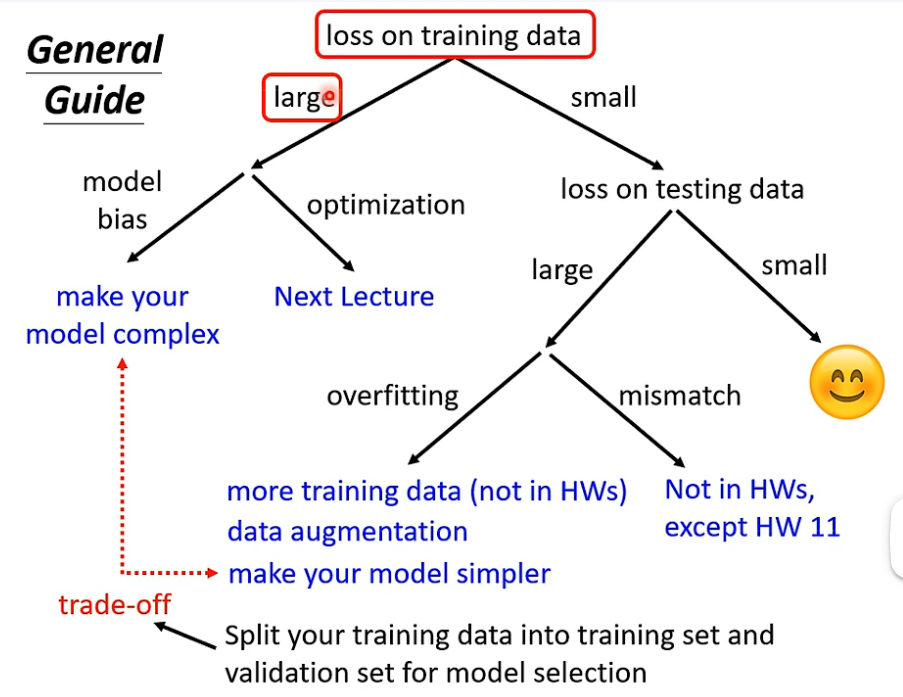

# Regression notes
---
* 确定结构
* Loss 函数
* 求解
  
## regularization
$L=MSE+\lambda \sum (w_i)^2$
> 更平滑

## validation

# Generative model
贝叶斯公式 估测值
算P(x|C) 高斯分布
> 由样本点推测出高斯分布 取x在该分布的几率
> L最大似然函数

## Optimization
taylor展开 Hessian矩阵的特征值 ($V^T Hv>0$)(正定矩阵) 防止影响

