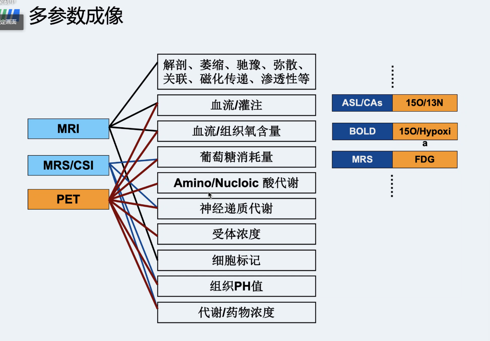
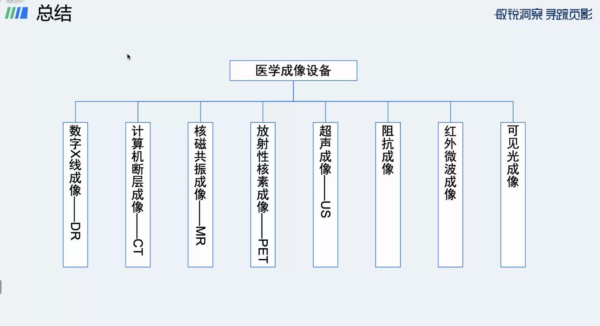
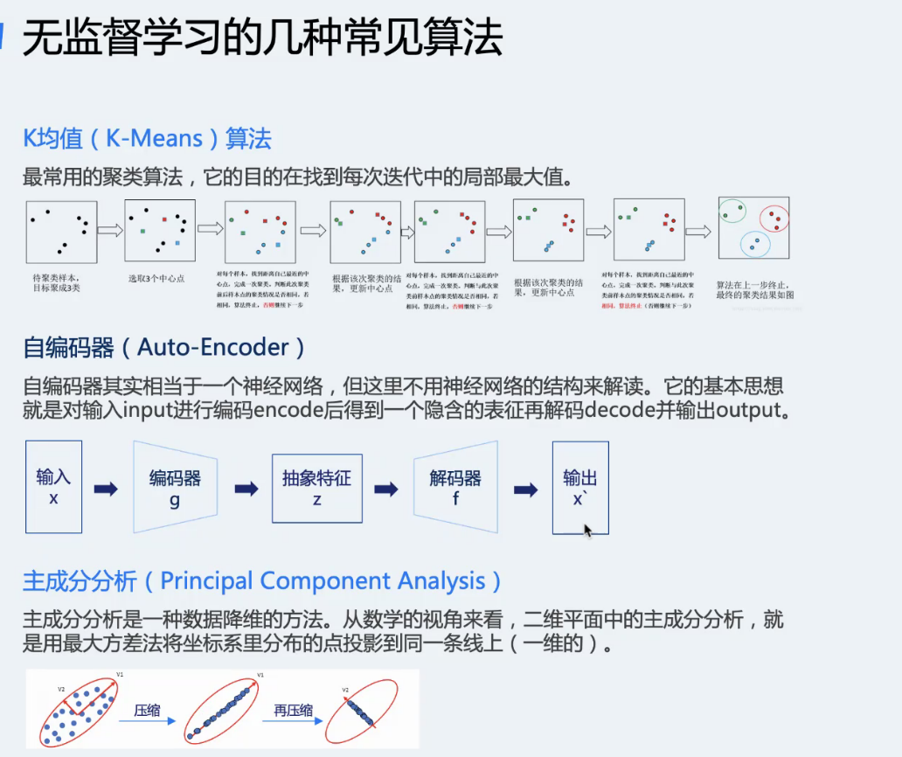
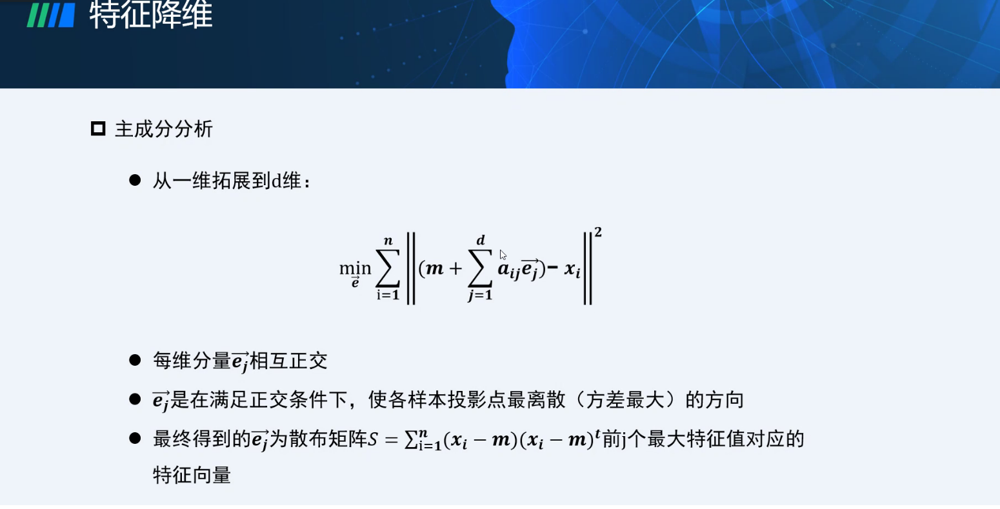
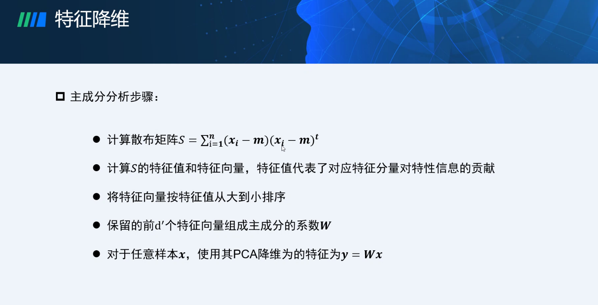
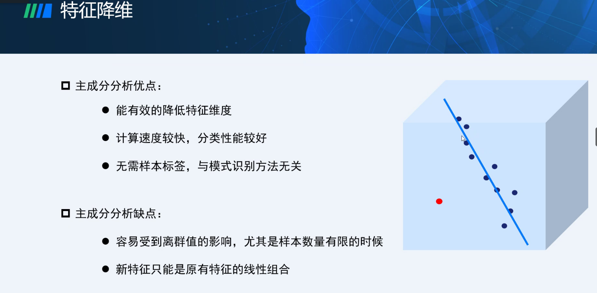
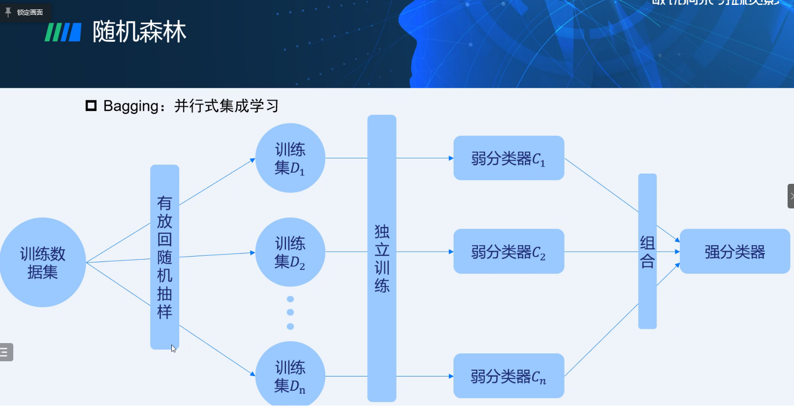
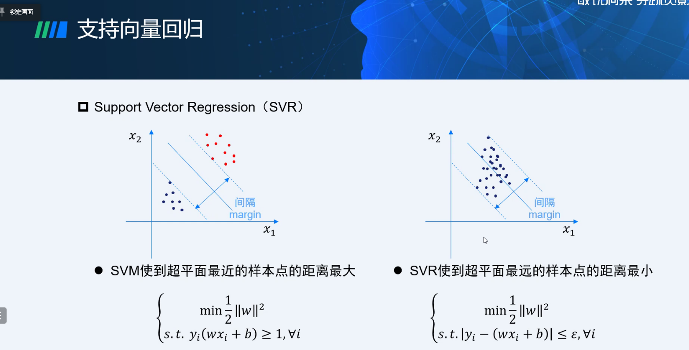
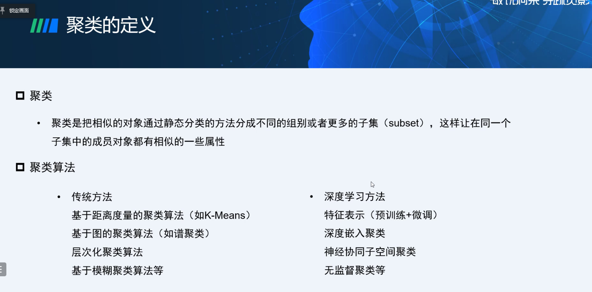
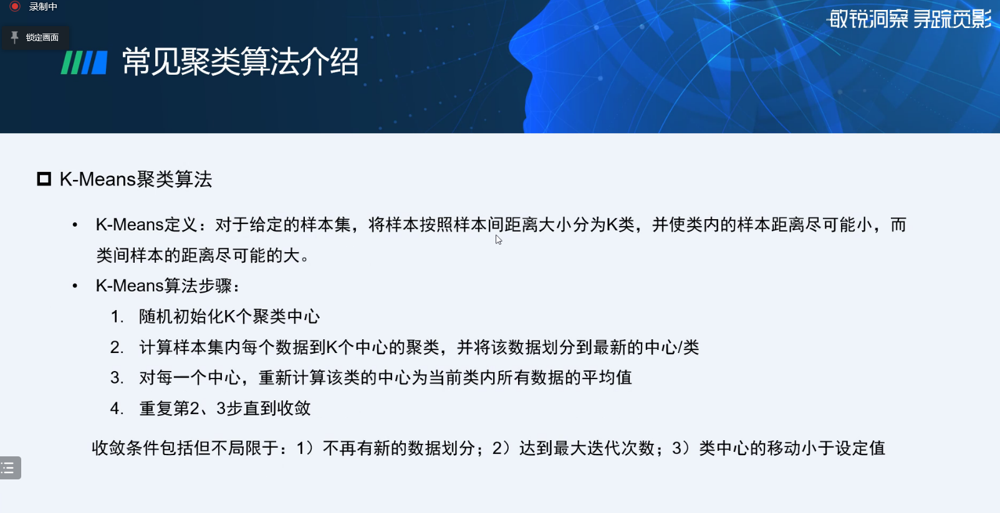

# 医学成像
## x射线
穿透 荧光 电离（测量）
原理： 衰减曲线不同 
缺陷：遮挡（二维）
## CT
### X-CT
#### 窗宽&窗位
窗宽窄：对比度高
窗宽宽：掩盖细微特征

### OCT
眼科 光学（无辐射）

## PET
癌症/神经系统/心血管
正电子放射性核素

## MR
### fMRI
脑部

## 超声成像
机械波

# 人工智能

## 传统机器学习
> 维度灾难

### 特征选择
* 相关性分析
* * 协方差 cov
* * Pearson系数$\rho$
* 循环选择

### 无监督学习
主成分分析

独立成分分析

## 分类算法

### Logistic Regression
线性——核函数

### SVM

## RF 随机森林

## 回归算法
### 略
### Lasso
### SVR

## 聚类

