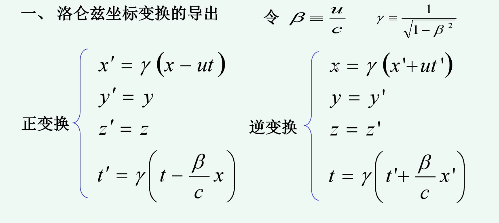
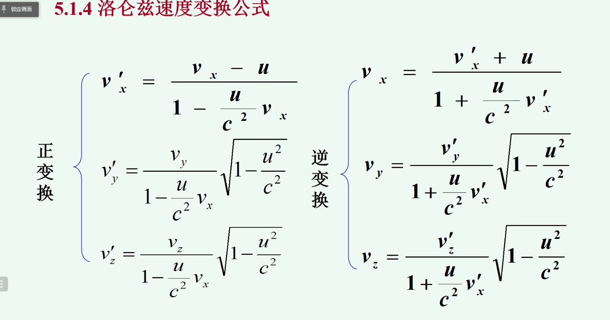

# 狭义相对论
注意看$\ne$观测
## 历史
绝对静止参考系
以太
## 基本原理
* 假设一 : 物理定律在一切惯性系相同
* 假设二： 光速不变
## 时空观
### 同时的相对性

同时性与观测者所处的参考系有关

### 时间膨胀
* proper time $\tau_0$
  > 本征时间/固有时间 某事件在某其静止的惯性系中的发生时间差

tip: 在哪个参考系测量就要有对应参考系的时钟

$\Delta t=\displaystyle\frac{\tau_0}{\sqrt{1-\frac{u^2}{c^2}}}$

> 加速/减速中 物体处于引力场 使动钟减慢
> 相对性：在S’系中的观测者看来 S系中的时钟也变慢了

* 异地钟校准
异地后在同一惯性参考系校准即可

* 时钟详谬
  双生子甲乙一个在地球一个乘坐高速飞船，重逢时乙比甲年轻
  > 乙变换了惯性系，此问题暂不能用狭义相对论解释

### 长度收缩  
> L' 固有长度 静长
> 垂直长度未变化

$l=l'\sqrt{1-\frac{u^2}{c^2}}$

## 洛伦兹坐标变换
> 当两参考系坐标原点重合时，校准时钟

### 因果关系事件发生次序的绝对性
注意其中的消息传递时间差

物理定义 有因果关系$\displaystyle\frac{|x_1-x_2|}{|t_1-t_2|}=v<c$

## 洛伦兹速度变换公式

>buyongji

## 光的多普勒效应
略

## 相对论能量和质量

$m=\displaystyle\frac{m_0}{\sqrt{1-\frac{v^2}{c^2}}}$
$E_k=\displaystyle\frac{m_0c^2}{\sqrt(1-\frac{v^2}{c^2})}-m_0c^2$

$E=mc^2$

$E^2=p^2c^2+m_0^2c^4$