## 时间域
脉冲响应函数
### 微分方差
### 差分方程
### 状态函数(状态空间模型)
> 现代控制理论:多输入多输出/非线性/时变

状态变量设在积分器后面
线性化:
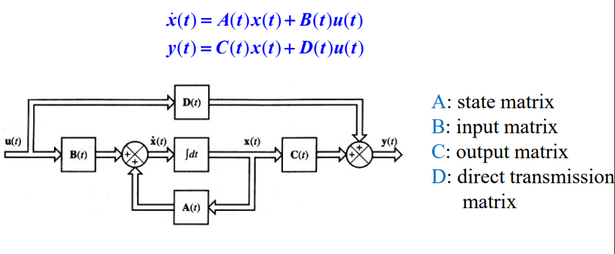
* 传递函数 $G(s)=C(sI-A)^{-1}B+D$
## 复数域
#### 传递函数
> 全部初始条件为0时,Y(s)/X(s), 仅能描述线性常微分

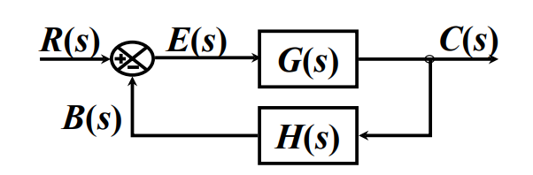
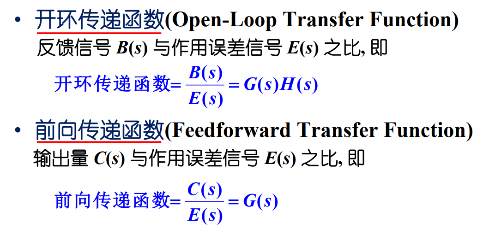
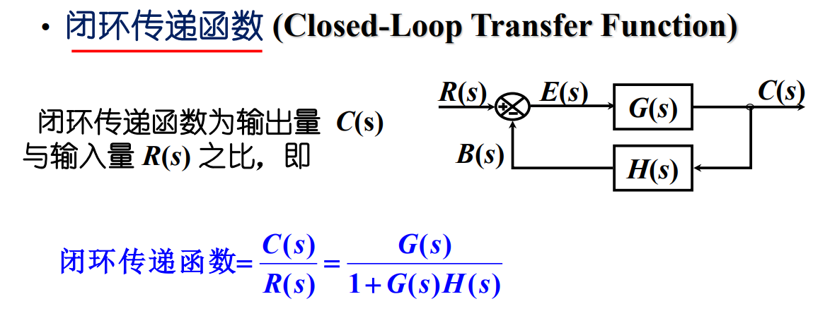
#### 结构图
* [考点]由方框图求闭环传递函数
  * 方框图简化
  前向通路传递函数乘积不变
  回路中传递函数乘积不变
  * 代数法
  列出来消中间变量
  * 梅逊公式
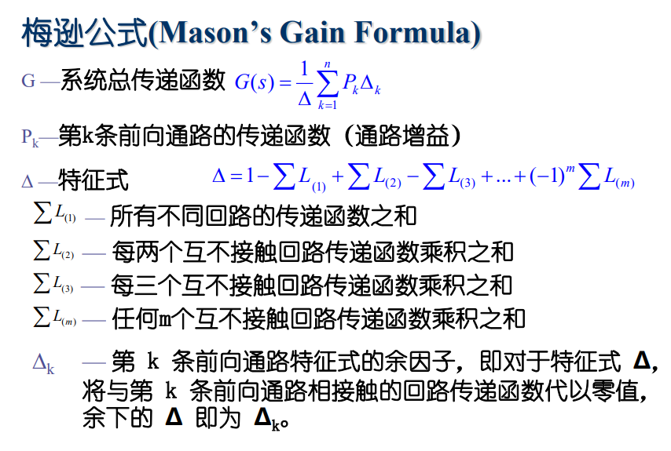

## 频率域
稳态
### 频率特性
开环-裕量
谐振峰幅值
谐振峰频率

### 根轨迹法
> 增益$0\to +\infty$,闭环系统特征方程根的轨迹
* 作图
* 校正
  * 超前校正
  改变极点:不稳定->稳定
  * 滞后校正
  稳态性能-静态增益
  * 滞后-超前校正
### 频率响应分析
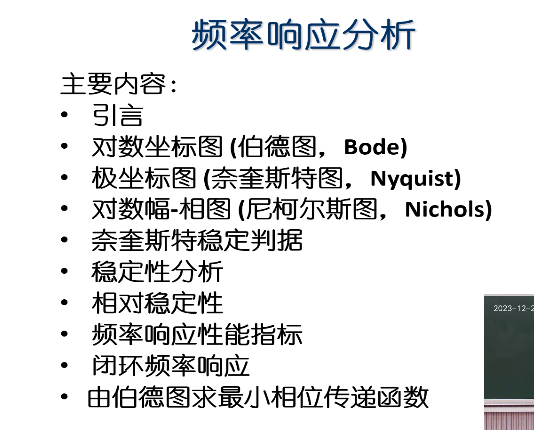
> 频率响应:系统对正弦输入信号的稳态响应
正弦传递函数:jw代替s
#### 对数坐标图/伯德图

#### 极坐标图
#### 奈奎斯特稳定判据

> 开环频率响应特性

稳定性分析
#### 对数幅相图

## 系统分析
#### 一阶系统
$\frac{C(s)}{R(s)}=\frac 1{Ts+1}$
* 单位脉冲响应 $c(t)=\frac 1 T e^{-t/T}$
* 单位阶跃响应 $c(t)=1-e^{- t/T}$
  * $c(t)|_{t=T}=0.632$
  * $\frac{dc(t)}{dt}|_{t=0}=\frac 1 T$
* 单位斜坡响应 $c(t)=t-T+Te^{-t/T}$
  * 稳态误差 $e(t)|_{t=\infty}=[T(1-e^{-t/T})]|_{t=\infty}=T$
#### 二阶系统
$\frac{C(s)}{R(s)}=\frac K{Js^2 +Bs+K}=\frac {\omega_n^2}{s^2 +2\zeta \omega_n s+\omega_n^2}$
* 参数
  * 无阻尼自然频率$\omega_n = \sqrt{K/J}$
  * 衰减系数 $\sigma=B/(2J)$
  * 阻尼比 $\zeta=\frac{\sigma}{\omega_n}=\frac{B}{B_c}=\frac{B}{2\sqrt{JK}}$
  * 阻尼自然频率 $\omega_d=\omega_n \sqrt{1-\zeta^2}$(可观察到的)

|$\zeta$|系统|极点|瞬态响应|误差|
|---|---|---|---|---|
|$0$|零阻尼系统|两虚轴上共轭复数|等幅振荡|
|$(0,1)$|欠阻尼系统|两左半s平面共轭复数|振荡|阻尼正弦震荡
|$1$|临界阻尼系统|负实轴重根|
|$(1,\infty)$|过阻尼系统|两不等负实数|近似一阶|

标准二阶系统(无零点)
* 性能
  * $t_r=\frac{1}{\omega_d}tan^{-1}(\frac{\omega_d}{-\sigma})=\frac{\pi- \beta}{\omega_d}$
  * $t_p=\frac{\pi}{\omega_d}$=阻尼振荡频率周期的一半
  * $M_p=e^{-(\zeta/\sqrt{1-\zeta^2})\pi}$
  * 衰减比(同方向相邻两个波峰) $n=e^{2\pi\zeta/\sqrt{1-\zeta^2}}$
  * $t_s=\frac{4}{\zeta\omega_n}/\frac{3}{\zeta \omega_n}$
* 同$\zeta$:相同相对稳定性系统
### 稳定性
稳定/临界稳定/不稳定
* 当且仅当所有闭环极点都位于左半s平面
* 劳斯稳定判据
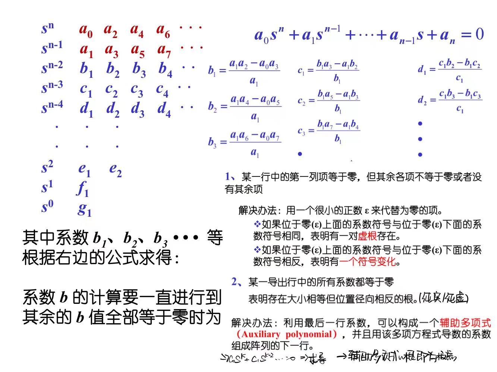

平移-相对稳定性
### 稳态性能
* 稳态误差
$\frac{E(s)}{R(s)} \to E(s)$
终值定理(对于稳定系统) $e_{ss}=lim_{t\to +\infty}e(t)=lim_{s\to 0}sE(s)$

按开环传递函数中包含积分环节的数目进行分类
单位负反馈系统:

|系统类型|单位阶跃$e_{ss}=\frac{1}{1+K_p}$|单位斜坡$e_{ss}=\frac 1 {K_v}$|单位抛物线$e_{ss}=\frac 1 {K_a}$|
|---|---|---|---|
|常数|静态位置误差常数$K_p=lim_{s\to 0}G(s)$|静态速度误差常数$K_v=lim_{s\to 0}sG(s)$|静态加速度误差常数$K_a=lim_{s\to 0}s^2G(s)$|
|0型|$\frac 1{1+K}$|$+\infty$|$+\infty$|
|1型|$0$|$\frac 1 K$|$+\infty$|
|2型|0|0|$\frac 1 K$|
* 闭环主导极点
### 瞬态性能
> 标准初始条件:系统静止/输出量和输出量对时间的各阶导数=0

瞬态响应性能指标
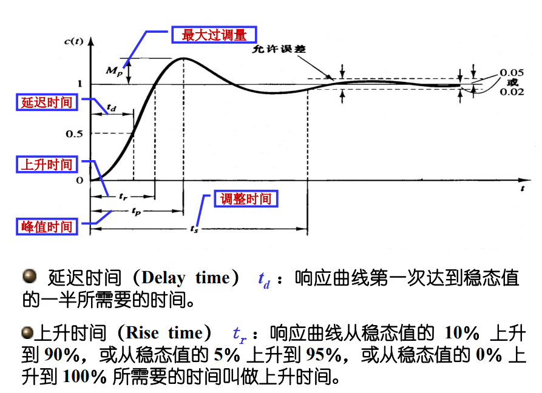
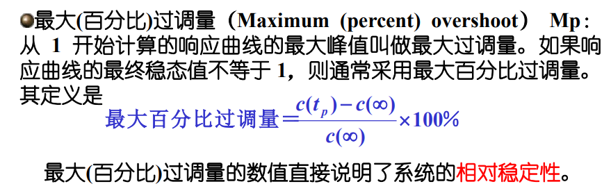

## 分析设计

### 状态空间分析
#### 状态空间表达式
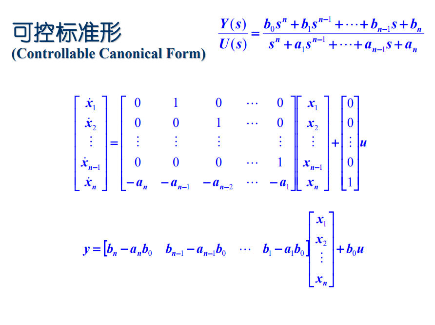
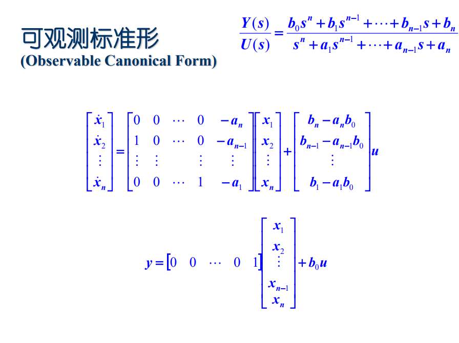

#### 状态转移矩阵
* 齐次
$\phi(t)$:$x(t)=\phi(t)x(0)$
$\dot{\phi}(t)=A \phi(t)$

> 包含$\dot{x}(t)=Ax(t)$描述的系统自由运动(无外u)的全部信息

矩阵指数$e^{At}=\sum_{k=0}^{+\infty}\frac{A^k t^k}{k!}=L^{-1}[(sI-A)^{-1}]=\phi(t)$
* 非齐次

$x(t)=\phi(t)x(0)+\int_{0}^t \phi(t-\tau)Bu(\tau)d\tau$

$x(t)=e^{A(t-t_0)}x(t_0)+\int_{t_0}^t e^{A(t-\tau)}Bu(\tau)d\tau$

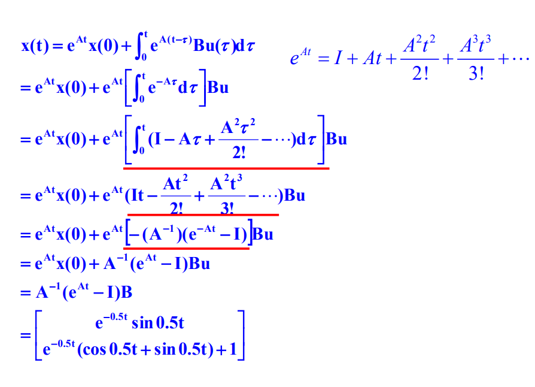
- [ ] 我觉得这很酷但我不会算
#### 性质
##### 可控性
> 施加一无约束的控制信号,在有限的时间间隔内使初始状态转移到任一终止状态

* 状态完全可控 
  * $[B|AB|\cdots|A^{n-1}B]$行满秩
  * 传递函数/传递矩阵$X/U=(SI-A)^{-1}B$不出现相约模态
* 输出可控性
  * $[CB|CAB|\cdots|CA^{n-1}B|D]$行满秩

* 状态可控与输出可控不相关
* 可稳定性
对于一个部分可控的系统,其不可控的模态是稳定的,而不稳定的模态是可控的
##### 可观性
> 每一个状态,在有限的时间间隔内能由y观测值确定

* 完全可观
  * $[C|CA|\cdots|CA^{N-1}]^T$列满秩
  * ==$X/Y$不相约 no==

* 可检测性
对于一个部分可观的系统,其不可观测的模态是稳定的,可观测的模态是不稳定的
##### 对偶性
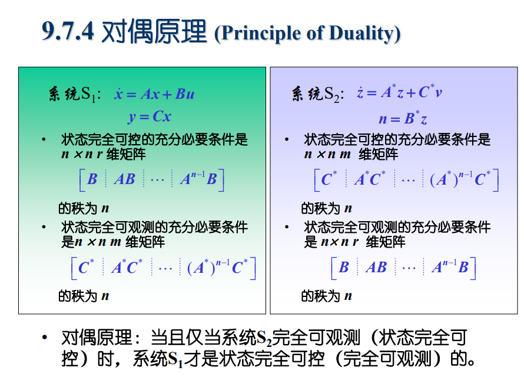

可检测性和可稳定性互为对偶

#### 状态空间设计
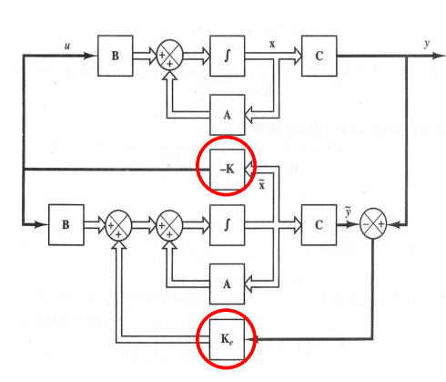
##### 极点配置
> 把所有闭环极点配置到希望的位置

> 假设:
> 1.用于反馈的状态变量都是可观测的(物理可观测/软测量)
> 2.状态完全可控(充分必要条件)
> 3.单输入单输出系统
> 4.参考输入为0

$\dot{x}(t)=(A-BK)x(t)$
$x(t)=e^{(A-BK)t}x(0)$

* 变换矩阵T法
*先检查是否完全可控！*
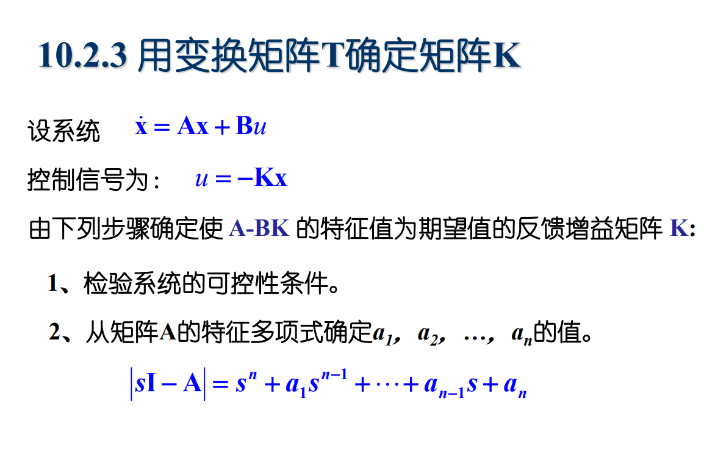
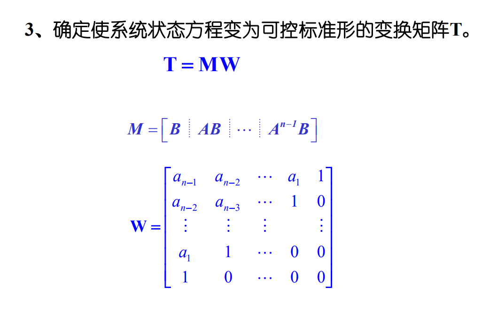
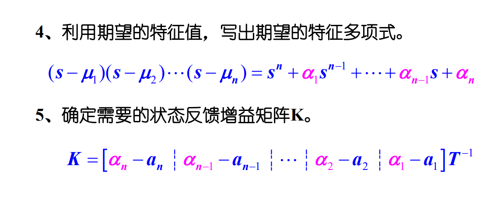

* 直接代入法
设$K=[k_1, k_2, k_3]$
$|sI-A+BK|=(s-\mu_1)(s-\mu_2)(s-\mu_3)$

##### 全阶状态观测器

> 估计不可用的状态变量

> 充分必要条件:可观测性-对偶系统状态完全可控

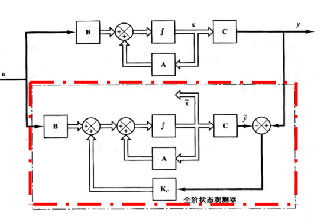
$\dot{\tilde{x}}=A\tilde{x}+Bu+K_e(y-C\tilde{x})$
补偿$A$,$B$和初始状态与估计值间的不精确性

$e=x-\tilde{x}$
$\dot{e}=(A-K_eC)e$

选择合适的$K_e$使其稳定(快速响应和对干扰噪声灵敏性的折中)
对对偶系统
$\dot{z}=A^*z+C^*v$
$n=B^*z$
进行极点配置
$|sI-A^*+C^*K|$
$K_e=K^*$
* 矩阵变换法
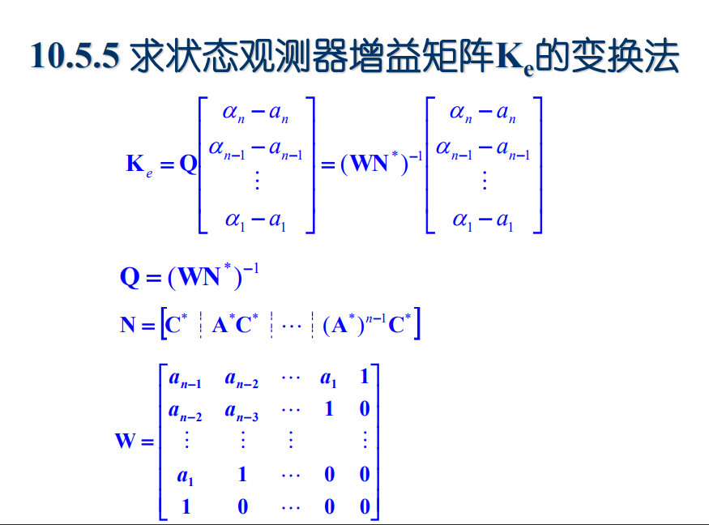
* 直接代入法
设$K=[k_{e1}, k_{e2}, k_{e3}]^T$
$|sI-A+K_eC|=(s-\mu_1)(s-\mu_2)(s-\mu_3)$

##### 联合

$$
 \left[
 \begin{matrix}
   \dot{x} \\
   \dot{e}
  \end{matrix}
  \right]=
   \left[
 \begin{matrix}
   A-BK & BK \\
   0 & A-K_eC
  \end{matrix}
  \right]
   \left[
 \begin{matrix}
  x \\
  e
  \end{matrix}
  \right]
$$
极点互相独立
控制器-观测器 传递函数$U(s)/Y(s)=...$

* 最小阶观测器=状态向量维数-输出向量维数

##### 二次型最佳调节器系统
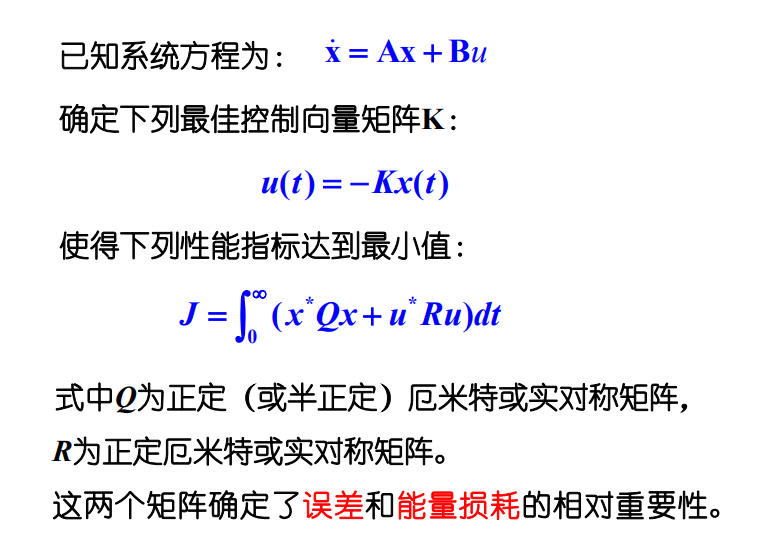