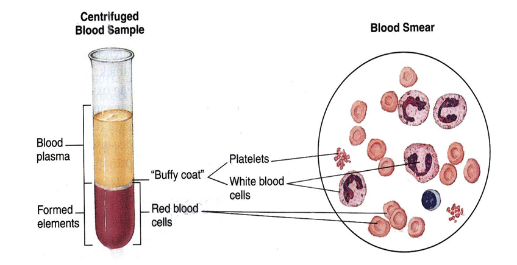
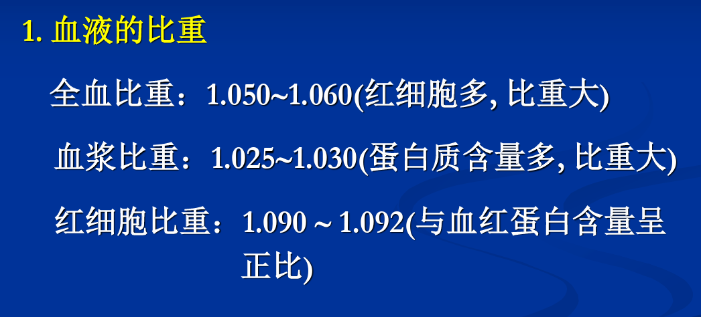
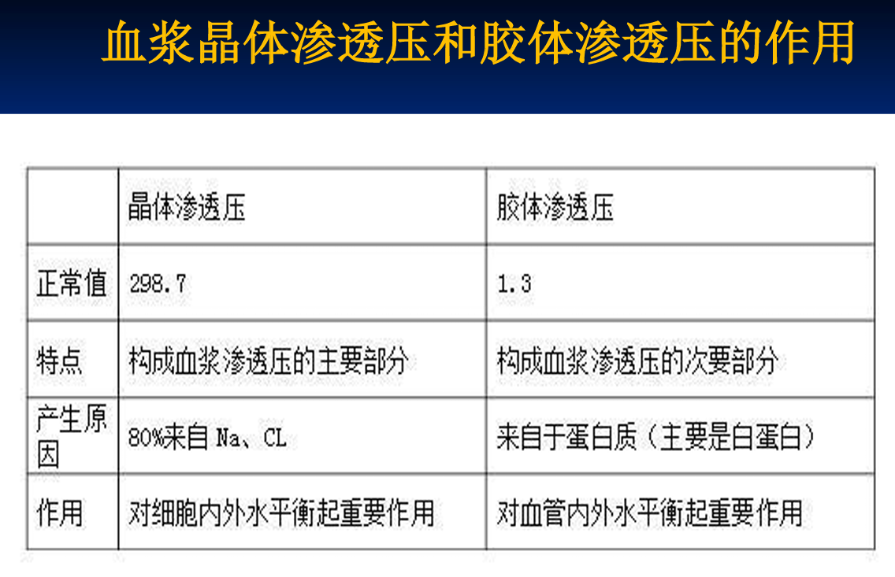
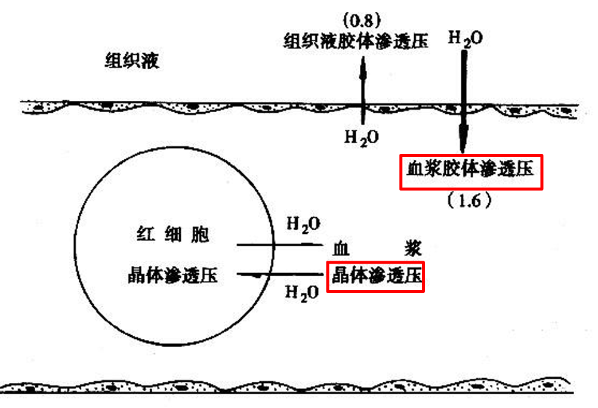

# 解剖与生理Ⅱ

> task: 解剖3D学习软件 综述

## 血液

液体总重(水+溶解物)占人体总体重60%
其中, 40%-细胞内液;20%-细胞外液(==5%-血浆==; 15%-组织液)

* 功能
  * 运输:O2/CO2/营养物质
  * 调节:pH/t
  * 保护防御:免疫

* 血量(血浆和血细胞的总和):==体重7%-8%==
  * 循环血量:大部分心血管(v↑)
  * 贮备血量:肝/肺/腹腔静脉/皮下动脉(v↓)
  * 失血(血量恒定->血压恒定)
    * <10%: 调节恢复->生成红细胞
    * $\ge$20%: 无法维持动脉血压->功能障碍->临床症状
    * $\ge$30%: 生命危险

### 血浆
* 水
* 电解质/无机盐
* 小分子化合物
* 血浆蛋白
  * 白蛋白(M↓ c↑): 形成胶体渗透压
  肝功能疾病(肝癌/肝炎)/营养不良->缺少易水肿
  * 球蛋白: $\alpha$/$\beta$: 运输脂质和脂溶激素 /$\gamma$: 抗体
  * 纤维蛋白原(M↑ c↓): 血液凝固
  > 除$\gamma-globulin$由免疫B细胞产生外, 其余血浆蛋白均在肝脏中产生后进入血浆
  
  > 功能:形成胶体渗透压/维持激素半衰期/运输功能/参与血液凝固,抗凝和纤溶/免疫功能/营养功能
> 血浆中`[Na+]` `[Cl-]`> 细胞内液: 晶体渗透压
> 血浆中`[pr]`> 组织液: 胶体渗透压

### 血细胞
红细胞RBC
白细胞WBC
血小板TC

* 血细胞比容(血细胞体积/血样总体积 百分比): 新生儿>成年男性>成年女性(新生儿相对厌氧环境/性别激素作用)

* 血液比重

* 血液粘度/粘滞性:由液体内部分子或颗粒间的内摩擦形成。红细胞数, 血浆蛋白含量和血流速度等影响决定黏度

> 高原->粘度↑->阻力↑->1.红细胞↑->心脏做功↑负担↑ 2.流速↓->易堵塞/血栓
* 渗透压: 主要与溶液中溶质颗粒数的多少呈正变,与溶质种类及颗粒大小无关

  * ==单位:毫渗==
  * 等渗/等张 
  等渗溶液： 渗透压与血浆渗透压相等的溶液
  等张溶液：使悬浮于其中的红细胞能保持正常形态和大小的溶液。
  (由不能自由通过细胞膜的溶质所形成的等渗溶液->引起溶血)
  > 0.85%NaCl溶液 等渗且等张 / 5% glu (aq)
### 生理止血,血液凝固与纤维蛋白溶解
### 血型与输血原则