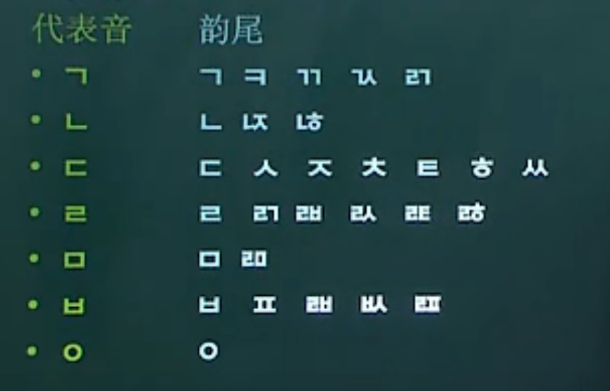
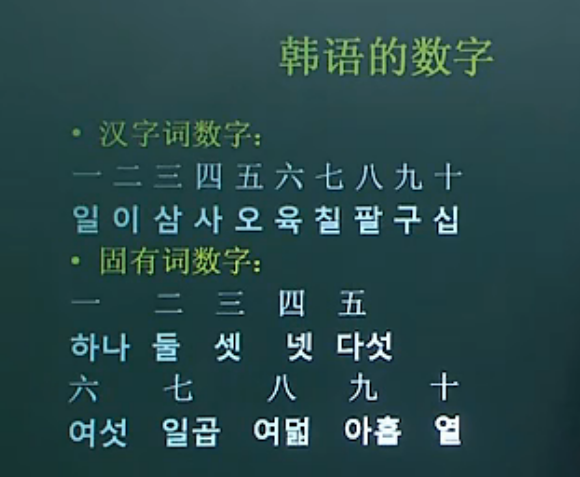
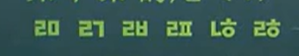
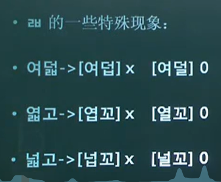
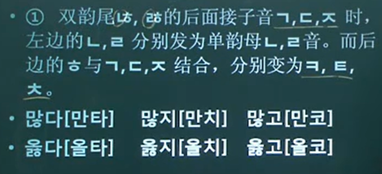
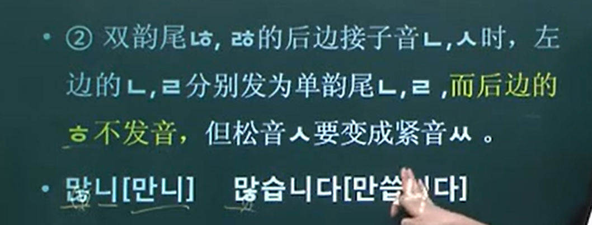
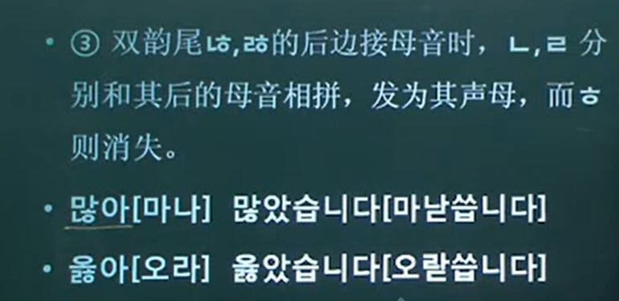
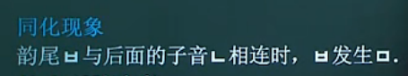
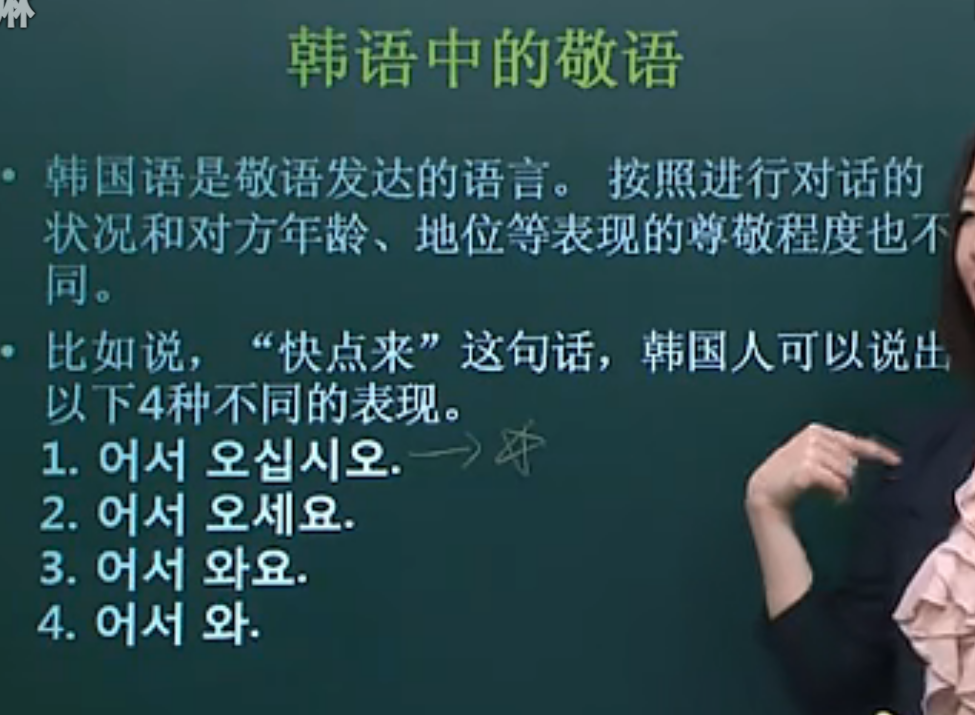
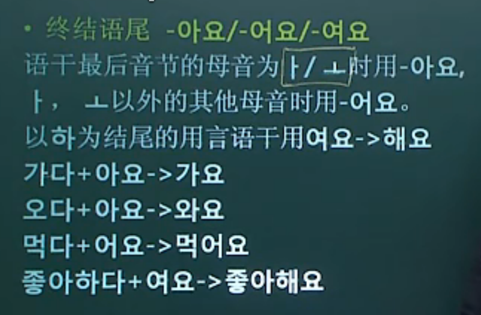

# 一些韩语的小笔记
---
## 基础知识
40个字母 母音21（元） 子音19（辅）
天地人

## 数字

### 固有词数字
时间

## 韵尾

只发左边 后面的字是母音开头的话右边连音

只发右边 后面母音相连时发左音，右音连

이다 + ㅂ니다 = 입니다
主格助词：
无韵尾 + 는 / 有韵尾 + 은
无韵尾 + 가 / 有韵尾 + 이 /名词后表示主语

宾语助词
有韵尾 + 을 / 无韵尾 + 를
저도 중국인입니다

动词 + 고 싶다 想

终结语尾
最后音节的母音 ㅏ/ㅗ 아요
以外 어요
하 여요 -> 해요